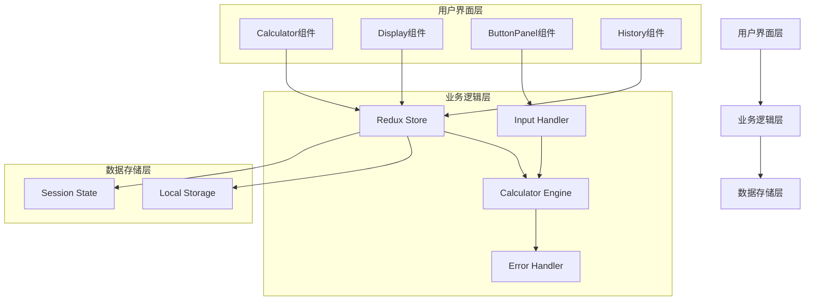
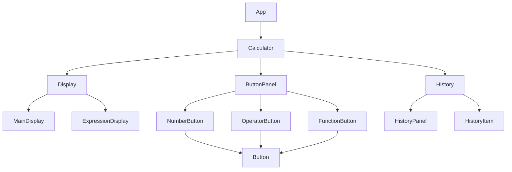
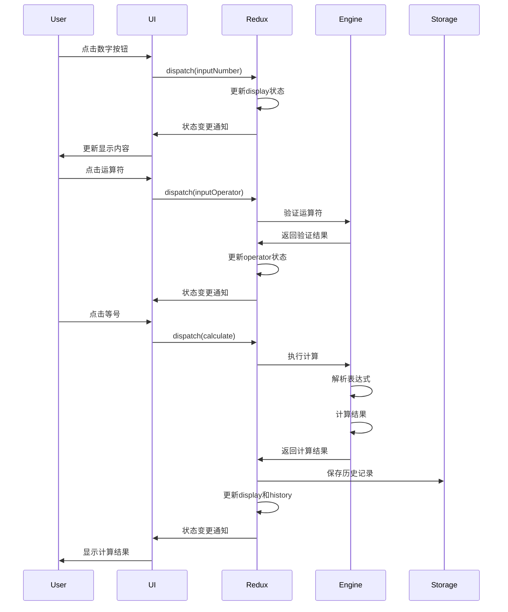

# 计算器应用设计规格

## 1. 系统架构设计

### 1.1 整体架构图



### 1.2 组件层次结构



## 2. 数据流设计

### 2.1 Redux状态结构

```typescript
interface CalculatorState {
  // 显示相关
  display: string;              // 当前显示内容
  expression: string;           // 当前表达式
  
  // 计算状态
  currentValue: number;         // 当前值
  previousValue: number;        // 前一个值
  operator: string | null;      // 当前运算符
  waitingForOperand: boolean;   // 等待操作数
  
  // 历史记录
  history: HistoryItem[];       // 历史记录数组
  
  // 错误状态
  isError: boolean;             // 是否有错误
  errorMessage: string;         // 错误信息
}

interface HistoryItem {
  id: string;
  expression: string;
  result: string;
  timestamp: number;
  isError: boolean;
}
```

### 2.2 数据流时序图



## 3. 核心模块设计

### 3.1 计算引擎设计

```typescript
class CalculatorEngine {
  private precision: number = 15;
  
  // 主要方法
  calculate(expression: string): CalculationResult;
  parseExpression(input: string): ParsedExpression;
  evaluate(tokens: Token[]): number;
  formatResult(value: number): string;
  
  // 辅助方法
  private tokenize(expression: string): Token[];
  private validateExpression(tokens: Token[]): boolean;
  private handlePrecedence(tokens: Token[]): Token[];
  private executeOperation(a: number, b: number, op: string): number;
}

interface CalculationResult {
  value: number;
  formatted: string;
  isError: boolean;
  errorMessage?: string;
}

interface ParsedExpression {
  tokens: Token[];
  isValid: boolean;
  errorMessage?: string;
}

interface Token {
  type: 'number' | 'operator' | 'function';
  value: string | number;
  precedence?: number;
}
```

### 3.2 输入处理器设计

```typescript
class InputHandler {
  // 处理数字输入
  handleNumberInput(current: string, digit: string): string;
  
  // 处理运算符输入
  handleOperatorInput(state: CalculatorState, operator: string): CalculatorState;
  
  // 处理小数点输入
  handleDecimalInput(current: string): string;
  
  // 处理清除操作
  handleClear(type: 'C' | 'AC', state: CalculatorState): CalculatorState;
  
  // 验证输入
  validateInput(input: string, currentState: CalculatorState): boolean;
}
```

### 3.3 存储服务设计

```typescript
class StorageService {
  private readonly HISTORY_KEY = 'calculator_history';
  private readonly MAX_HISTORY = 10;
  
  // 保存历史记录
  saveHistory(item: HistoryItem): void;
  
  // 获取历史记录
  getHistory(): HistoryItem[];
  
  // 清除历史记录
  clearHistory(): void;
  
  // 删除特定历史项
  removeHistoryItem(id: string): void;
}
```

## 4. UI设计规范

### 4.1 布局设计

```css
/* PC端布局 */
.calculator {
  width: 320px;
  height: 480px;
  display: grid;
  grid-template-rows: 120px 1fr;
  gap: 10px;
}

.display {
  background: #000;
  color: #fff;
  padding: 20px;
  text-align: right;
  font-size: 2rem;
}

.button-panel {
  display: grid;
  grid-template-columns: repeat(4, 1fr);
  gap: 1px;
}

/* 移动端适配 */
@media (max-width: 768px) {
  .calculator {
    width: 100vw;
    height: 100vh;
    grid-template-rows: 150px 1fr;
  }
  
  .button {
    min-height: 60px;
    font-size: 1.5rem;
  }
}
```

### 4.2 组件样式规范

```typescript
// 按钮样式类型
interface ButtonStyle {
  primary: string;    // 数字按钮
  operator: string;   // 运算符按钮
  function: string;   // 功能按钮
  equals: string;     // 等号按钮
}

// 颜色主题
interface ColorTheme {
  background: string;
  display: string;
  buttonPrimary: string;
  buttonOperator: string;
  buttonFunction: string;
  text: string;
  textSecondary: string;
}
```

### 4.3 响应式断点

```typescript
const breakpoints = {
  mobile: '320px',
  tablet: '768px',
  desktop: '1024px',
  large: '1440px'
};
```

## 5. API接口设计

### 5.1 Redux Actions

```typescript
// 数字输入
interface InputNumberAction {
  type: 'INPUT_NUMBER';
  payload: string;
}

// 运算符输入
interface InputOperatorAction {
  type: 'INPUT_OPERATOR';
  payload: string;
}

// 计算
interface CalculateAction {
  type: 'CALCULATE';
}

// 清除
interface ClearAction {
  type: 'CLEAR';
  payload: 'C' | 'AC';
}

// 历史记录操作
interface HistoryAction {
  type: 'LOAD_HISTORY_ITEM' | 'CLEAR_HISTORY';
  payload?: string;
}
```

### 5.2 组件Props接口

```typescript
// Calculator组件
interface CalculatorProps {
  theme?: 'light' | 'dark';
  precision?: number;
  maxHistoryCount?: number;
}

// Display组件
interface DisplayProps {
  value: string;
  expression: string;
  isError: boolean;
}

// Button组件
interface ButtonProps {
  value: string;
  type: 'number' | 'operator' | 'function' | 'equals';
  onClick: (value: string) => void;
  disabled?: boolean;
}

// History组件
interface HistoryProps {
  items: HistoryItem[];
  onItemClick: (item: HistoryItem) => void;
  onClear: () => void;
}
```

## 6. 错误处理设计

### 6.1 错误类型定义

```typescript
enum CalculatorError {
  DIVISION_BY_ZERO = 'DIVISION_BY_ZERO',
  INVALID_EXPRESSION = 'INVALID_EXPRESSION',
  NUMBER_OVERFLOW = 'NUMBER_OVERFLOW',
  INVALID_INPUT = 'INVALID_INPUT'
}

interface ErrorState {
  hasError: boolean;
  errorType: CalculatorError | null;
  errorMessage: string;
}
```

### 6.2 错误处理策略

```typescript
class ErrorHandler {
  handleError(error: CalculatorError): ErrorState {
    switch (error) {
      case CalculatorError.DIVISION_BY_ZERO:
        return {
          hasError: true,
          errorType: error,
          errorMessage: 'Cannot divide by zero'
        };
      
      case CalculatorError.NUMBER_OVERFLOW:
        return {
          hasError: true,
          errorType: error,
          errorMessage: 'Number too large'
        };
      
      default:
        return {
          hasError: true,
          errorType: error,
          errorMessage: 'Invalid operation'
        };
    }
  }
}
```

## 7. 性能优化设计

### 7.1 组件优化

```typescript
// 使用React.memo优化组件渲染
const Button = React.memo<ButtonProps>(({ value, type, onClick }) => {
  const handleClick = useCallback(() => {
    onClick(value);
  }, [value, onClick]);
  
  return (
    <button className={`button button--${type}`} onClick={handleClick}>
      {value}
    </button>
  );
});

// 使用useMemo优化计算
const Calculator: React.FC = () => {
  const formattedDisplay = useMemo(() => {
    return formatDisplayValue(display);
  }, [display]);
  
  return <Display value={formattedDisplay} />;
};
```

### 7.2 状态优化

```typescript
// 使用immer简化状态更新
const calculatorSlice = createSlice({
  name: 'calculator',
  initialState,
  reducers: {
    inputNumber: (state, action) => {
      // immer自动处理不可变更新
      state.display = handleNumberInput(state.display, action.payload);
    }
  }
});
```

## 8. 测试设计

### 8.1 单元测试覆盖

- 计算引擎：所有运算函数和边界情况
- 输入处理：各种输入组合和验证
- 状态管理：Redux reducers和actions
- 组件：UI交互和渲染逻辑

### 8.2 集成测试场景

- 完整计算流程测试
- 历史记录功能测试
- 错误处理流程测试
- 跨平台兼容性测试
