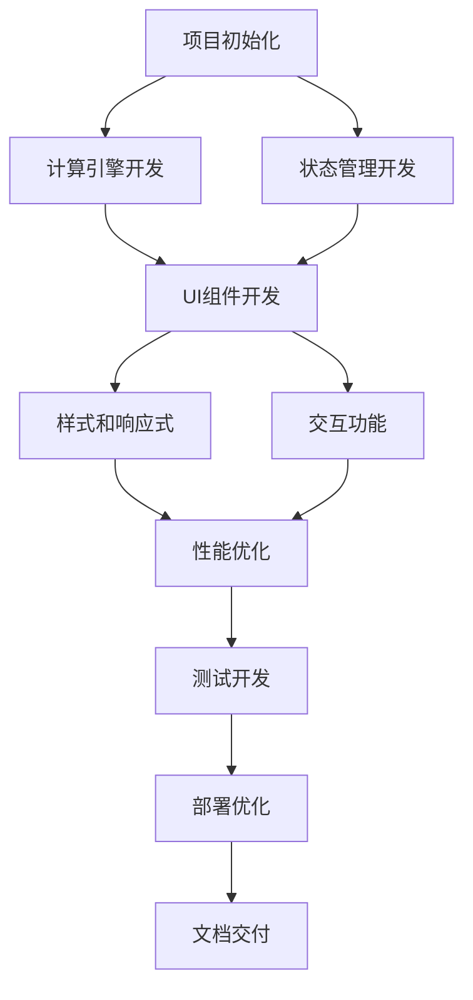

# 计算器应用开发任务

## 1. 项目初始化任务

### 1.1 项目脚手架搭建
**任务描述**: 使用Vite创建React+TypeScript项目基础结构
**预期结果**: 完整的项目目录结构和基础配置文件
_需求: FR-2.5 响应式设计基础_

**子任务**:
- [✅] 使用Vite创建React+TypeScript项目
- [✅] 配置ESLint和Prettier代码规范
- [✅] 设置Git仓库和.gitignore文件
- [✅] 创建基础目录结构（components, store, services, utils等）

### 1.2 依赖包安装和配置
**任务描述**: 安装项目所需的核心依赖包并进行基础配置
**预期结果**: package.json包含所有必需依赖，配置文件就绪
_需求: NFR-2.1 浏览器兼容性_

**子任务**:
- [✅] 安装Redux Toolkit和React-Redux
- [✅] 安装Ant Design和Ant Design Mobile
- [✅] 安装decimal.js处理精度问题
- [✅] 安装测试相关依赖（Jest, React Testing Library）
- [✅] 配置TypeScript严格模式

## 2. 核心计算功能开发

### 2.1 计算引擎实现
**任务描述**: 实现核心计算逻辑，支持四则运算和表达式解析
**预期结果**: 完整的CalculatorEngine类，通过所有计算测试用例
_需求: FR-1.1, FR-1.2, FR-1.3, FR-1.4, FR-1.6_

**子任务**:
- [✅] 实现基础四则运算函数（加减乘除）
- [✅] 实现表达式解析器（tokenize和parse）
- [✅] 实现运算优先级处理
- [✅] 使用decimal.js确保计算精度
- [✅] 实现数字格式化和科学计数法显示

### 2.2 输入处理器实现
**任务描述**: 处理用户输入验证和状态转换逻辑
**预期结果**: InputHandler类处理所有输入场景
_需求: FR-1.5, FR-4.3_

**子任务**:
- [✅] 实现数字输入处理（包括小数点）
- [✅] 实现运算符输入验证
- [✅] 实现连续运算逻辑
- [✅] 实现输入边界检查和错误处理
- [✅] 防止重复小数点和无效输入

### 2.3 错误处理系统
**任务描述**: 实现完整的错误处理机制
**预期结果**: 所有异常情况都有适当的错误提示
_需求: FR-4.1, FR-4.2, FR-4.4_

**子任务**:
- [✅] 实现除零错误检测和处理
- [✅] 实现数字溢出检测
- [✅] 实现无效表达式错误处理
- [✅] 设计用户友好的错误提示信息
- [✅] 实现错误状态恢复机制

## 3. 状态管理开发

### 3.1 Redux Store配置
**任务描述**: 设置Redux Toolkit状态管理架构
**预期结果**: 完整的Redux store配置和类型定义
_需求: 整体状态管理需求_

**子任务**:
- [✅] 创建calculatorSlice定义状态结构
- [✅] 实现所有Redux actions和reducers
- [✅] 配置store和中间件
- [✅] 定义TypeScript类型接口
- [✅] 实现状态持久化逻辑

### 3.2 历史记录管理
**任务描述**: 实现计算历史记录的存储和管理
**预期结果**: 完整的历史记录功能，支持本地存储
_需求: FR-3.1, FR-3.2, FR-3.4_

**子任务**:
- [✅] 实现StorageService本地存储服务
- [✅] 实现历史记录的增删改查
- [✅] 限制历史记录最大数量（10条）
- [✅] 实现历史记录的时间戳和格式化
- [✅] 实现历史项点击加载功能

## 4. UI组件开发

### 4.1 Calculator主组件
**任务描述**: 实现计算器的主容器组件
**预期结果**: 完整的Calculator组件，整合所有子组件
_需求: FR-2.1, FR-2.5_

**子任务**:
- [✅] 创建Calculator主组件结构
- [✅] 集成Redux状态管理
- [✅] 实现组件间通信逻辑
- [✅] 添加键盘事件监听
- [✅] 实现响应式布局基础

### 4.2 Display显示组件
**任务描述**: 实现计算器显示屏组件
**预期结果**: 美观的显示界面，支持多行显示
_需求: FR-2.1_

**子任务**:
- [✅] 创建MainDisplay主显示区域
- [✅] 创建ExpressionDisplay表达式显示
- [✅] 实现文本溢出处理
- [✅] 添加显示动画效果
- [✅] 实现错误状态显示样式

### 4.3 ButtonPanel按钮面板
**任务描述**: 实现计算器按钮面板和各类按钮组件
**预期结果**: 完整的按钮面板，支持所有输入操作
_需求: FR-2.2, FR-2.3, FR-2.4_

**子任务**:
- [✅] 创建Button基础组件
- [✅] 实现NumberButton数字按钮（0-9）
- [✅] 实现OperatorButton运算符按钮（+、-、×、÷）
- [✅] 实现FunctionButton功能按钮（=、C、AC）
- [✅] 添加按钮点击反馈效果

### 4.4 History历史记录组件
**任务描述**: 实现历史记录面板和相关交互
**预期结果**: 可展开的历史记录面板，支持历史项操作
_需求: FR-3.3, FR-3.4_

**子任务**:
- [✅] 创建HistoryPanel历史面板容器
- [✅] 实现HistoryItem历史项组件
- [✅] 添加面板展开/收起动画
- [✅] 实现历史项点击和删除功能
- [✅] 添加空状态和加载状态

## 5. 样式和响应式设计

### 5.1 基础样式系统
**任务描述**: 建立项目的样式规范和基础样式
**预期结果**: 统一的样式系统和设计规范
_需求: NFR-3.1, NFR-3.2_

**子任务**:
- [✅] 定义颜色主题和设计token
- [✅] 创建全局样式和重置样式
- [ ] 实现CSS Modules配置
- [ ] 定义组件样式规范
- [ ] 添加深色/浅色主题支持

### 5.2 响应式适配
**任务描述**: 实现PC端和移动端的响应式适配
**预期结果**: 在所有设备上都有良好的显示效果
_需求: FR-2.5, NFR-2.3, NFR-3.2_

**子任务**:
- [✅] 定义响应式断点
- [ ] 实现移动端布局适配
- [ ] 优化触摸按钮大小（≥44px）
- [ ] 添加移动端手势支持
- [ ] 测试各种屏幕尺寸适配

## 6. 交互功能开发

### 6.1 键盘输入支持
**任务描述**: 实现PC端键盘快捷键支持
**预期结果**: 完整的键盘操作体验
_需求: NFR-3.3_

**子任务**:
- [ ] 实现数字键（0-9）输入监听
- [ ] 实现运算符键（+、-、*、/）监听
- [ ] 实现功能键（Enter、Escape、Backspace）
- [ ] 添加键盘按下视觉反馈
- [ ] 处理键盘和鼠标事件冲突

### 6.2 触摸交互优化
**任务描述**: 优化移动端触摸交互体验
**预期结果**: 流畅的移动端操作体验
_需求: NFR-3.2_

**子任务**:
- [ ] 实现触摸按钮反馈效果
- [ ] 添加长按和双击处理
- [ ] 优化触摸延迟和响应
- [ ] 实现滑动手势（历史面板）
- [ ] 防止误触和多点触控问题

## 7. 性能优化任务

### 7.1 组件性能优化
**任务描述**: 优化React组件渲染性能
**预期结果**: 满足性能需求指标
_需求: NFR-1.1, NFR-1.2_

**子任务**:
- [ ] 使用React.memo优化组件重渲染
- [ ] 实现useMemo和useCallback优化
- [ ] 优化Redux状态更新逻辑
- [ ] 实现组件懒加载
- [ ] 添加性能监控和分析

### 7.2 内存和资源优化
**任务描述**: 优化应用内存使用和资源加载
**预期结果**: 满足内存占用要求
_需求: NFR-1.4, NFR-4.2_

**子任务**:
- [ ] 优化历史记录内存管理
- [ ] 实现事件监听器清理
- [ ] 优化图片和静态资源
- [ ] 实现代码分割和按需加载
- [ ] 添加内存泄漏检测

## 8. 测试开发任务

### 8.1 单元测试
**任务描述**: 为核心功能编写单元测试
**预期结果**: 测试覆盖率≥90%
_需求: 代码质量保证_

**子任务**:
- [ ] 编写计算引擎测试用例
- [ ] 编写输入处理器测试
- [ ] 编写Redux状态管理测试
- [ ] 编写工具函数测试
- [ ] 编写错误处理测试

### 8.2 组件测试
**任务描述**: 为UI组件编写测试用例
**预期结果**: 所有组件都有对应测试
_需求: UI功能验证_

**子任务**:
- [ ] 编写Calculator组件测试
- [ ] 编写Display组件测试
- [ ] 编写ButtonPanel组件测试
- [ ] 编写History组件测试
- [ ] 编写交互行为测试

### 8.3 集成测试
**任务描述**: 编写端到端集成测试
**预期结果**: 完整功能流程测试通过
_需求: 整体功能验证_

**子任务**:
- [ ] 编写完整计算流程测试
- [ ] 编写历史记录功能测试
- [ ] 编写错误处理流程测试
- [ ] 编写响应式布局测试
- [ ] 编写性能基准测试

## 9. 部署和优化任务

### 9.1 构建优化
**任务描述**: 优化生产环境构建配置
**预期结果**: 最小化包体积，最优加载性能
_需求: NFR-1.3_

**子任务**:
- [ ] 配置Vite生产构建优化
- [ ] 实现代码压缩和混淆
- [ ] 优化CSS和静态资源
- [ ] 配置缓存策略
- [ ] 添加构建分析工具

### 9.2 部署配置
**任务描述**: 配置项目部署和CI/CD
**预期结果**: 自动化部署流程
_需求: 项目交付_

**子任务**:
- [ ] 配置静态文件部署
- [ ] 设置环境变量管理
- [ ] 配置自动化测试流程
- [ ] 添加部署脚本
- [ ] 配置监控和日志

## 10. 文档和交付任务

### 10.1 技术文档
**任务描述**: 编写完整的技术文档
**预期结果**: 清晰的项目文档和使用说明
_需求: 项目维护需要_

**子任务**:
- [ ] 更新README.md项目说明
- [ ] 编写API文档
- [ ] 编写组件使用文档
- [ ] 编写部署指南
- [ ] 编写故障排除指南

### 10.2 用户文档
**任务描述**: 编写用户使用文档
**预期结果**: 用户友好的使用指南
_需求: 用户体验_

**子任务**:
- [ ] 编写功能使用说明
- [ ] 创建快捷键参考
- [ ] 编写常见问题解答
- [ ] 制作使用演示视频
- [ ] 编写更新日志

## 任务依赖关系

## 里程碑计划

- **里程碑1**: 项目初始化和核心计算功能完成
- **里程碑2**: UI组件和基础交互完成
- **里程碑3**: 响应式设计和性能优化完成
- **里程碑4**: 测试和部署完成
- **里程碑5**: 文档和最终交付完成
