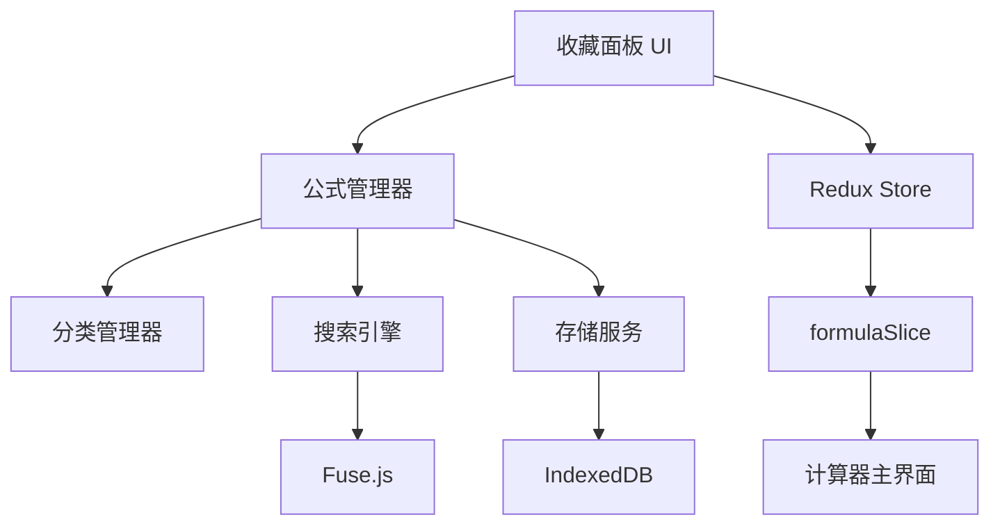

# 公式收藏功能设计文档

## 1. 系统架构

### 1.1 整体架构图



### 1.2 模块职责

- **收藏面板UI**: 用户交互界面，展示公式列表和操作按钮
- **公式管理器**: 核心业务逻辑，处理CRUD操作
- **分类管理器**: 分类相关的业务逻辑
- **搜索引擎**: 基于Fuse.js的模糊搜索功能
- **存储服务**: IndexedDB数据持久化
- **Redux Store**: 状态管理和数据流控制

## 2. 数据模型设计

### 2.1 公式数据结构

```typescript
interface Formula {
  id: string;                    // UUID唯一标识
  name: string;                  // 公式名称
  formula: string;               // 原始数学表达式
  expression: string;            // 计算表达式
  category: string;              // 所属分类
  createdAt: number;            // 创建时间戳
  updatedAt: number;            // 更新时间戳
  usageCount: number;           // 使用次数
  lastUsedAt: number;           // 最后使用时间
  tags: string[];               // 标签数组
  isFavorite: boolean;          // 是否标记为收藏
}
```

### 2.2 分类数据结构

```typescript
interface Category {
  id: string;                   // 分类ID
  name: string;                 // 分类名称
  color: string;                // 分类颜色
  icon: string;                 // 分类图标
  order: number;                // 排序序号
  isDefault: boolean;           // 是否为默认分类
  formulaCount: number;         // 包含公式数量
}
```

### 2.3 默认分类配置

```typescript
const DEFAULT_CATEGORIES: Category[] = [
  {
    id: 'basic',
    name: '基础运算',
    color: '#1890ff',
    icon: 'calculator',
    order: 1,
    isDefault: true,
    formulaCount: 0
  },
  {
    id: 'scientific',
    name: '科学计算',
    color: '#52c41a',
    icon: 'experiment',
    order: 2,
    isDefault: true,
    formulaCount: 0
  },
  {
    id: 'unit-conversion',
    name: '单位换算',
    color: '#faad14',
    icon: 'swap',
    order: 3,
    isDefault: true,
    formulaCount: 0
  },
  {
    id: 'financial',
    name: '财务计算',
    color: '#f5222d',
    icon: 'dollar',
    order: 4,
    isDefault: true,
    formulaCount: 0
  },
  {
    id: 'custom',
    name: '自定义',
    color: '#722ed1',
    icon: 'star',
    order: 5,
    isDefault: true,
    formulaCount: 0
  }
];
```

## 3. Redux状态管理

### 3.1 State结构

```typescript
interface FormulaState {
  formulas: Formula[];              // 公式列表
  categories: Category[];           // 分类列表
  selectedCategory: string;         // 当前选中分类
  searchQuery: string;              // 搜索关键词
  filteredFormulas: Formula[];      // 过滤后的公式列表
  isLoading: boolean;               // 加载状态
  isPanelVisible: boolean;          // 面板显示状态
  sortBy: 'name' | 'usage' | 'date'; // 排序方式
  sortOrder: 'asc' | 'desc';        // 排序顺序
}
```

### 3.2 Actions设计

```typescript
const formulaSlice = createSlice({
  name: 'formula',
  initialState,
  reducers: {
    // 公式操作
    addFormula: (state, action: PayloadAction<Formula>) => {
      state.formulas.unshift(action.payload);
      updateFilteredFormulas(state);
    },
    
    updateFormula: (state, action: PayloadAction<{id: string, updates: Partial<Formula>}>) => {
      const index = state.formulas.findIndex(f => f.id === action.payload.id);
      if (index !== -1) {
        state.formulas[index] = { ...state.formulas[index], ...action.payload.updates };
        updateFilteredFormulas(state);
      }
    },
    
    deleteFormula: (state, action: PayloadAction<string>) => {
      state.formulas = state.formulas.filter(f => f.id !== action.payload);
      updateFilteredFormulas(state);
    },
    
    incrementUsage: (state, action: PayloadAction<string>) => {
      const formula = state.formulas.find(f => f.id === action.payload);
      if (formula) {
        formula.usageCount += 1;
        formula.lastUsedAt = Date.now();
      }
    },
    
    // 分类操作
    addCategory: (state, action: PayloadAction<Category>) => {
      state.categories.push(action.payload);
    },
    
    updateCategory: (state, action: PayloadAction<{id: string, updates: Partial<Category>}>) => {
      const index = state.categories.findIndex(c => c.id === action.payload.id);
      if (index !== -1) {
        state.categories[index] = { ...state.categories[index], ...action.payload.updates };
      }
    },
    
    // 界面控制
    setSelectedCategory: (state, action: PayloadAction<string>) => {
      state.selectedCategory = action.payload;
      updateFilteredFormulas(state);
    },
    
    setSearchQuery: (state, action: PayloadAction<string>) => {
      state.searchQuery = action.payload;
      updateFilteredFormulas(state);
    },
    
    togglePanelVisibility: (state) => {
      state.isPanelVisible = !state.isPanelVisible;
    },
    
    setSortOptions: (state, action: PayloadAction<{sortBy: string, sortOrder: string}>) => {
      state.sortBy = action.payload.sortBy as any;
      state.sortOrder = action.payload.sortOrder as any;
      updateFilteredFormulas(state);
    }
  }
});
```

## 4. 核心服务设计

### 4.1 公式管理服务

```typescript
class FormulaManager {
  private db: IDBDatabase | null = null;
  
  async initialize(): Promise<void> {
    return new Promise((resolve, reject) => {
      const request = indexedDB.open('CalculatorFormulas', 1);
      
      request.onerror = () => reject(request.error);
      request.onsuccess = () => {
        this.db = request.result;
        resolve();
      };
      
      request.onupgradeneeded = (event) => {
        const db = (event.target as IDBOpenDBRequest).result;
        
        // 创建公式存储
        const formulaStore = db.createObjectStore('formulas', { keyPath: 'id' });
        formulaStore.createIndex('category', 'category', { unique: false });
        formulaStore.createIndex('name', 'name', { unique: false });
        formulaStore.createIndex('usageCount', 'usageCount', { unique: false });
        
        // 创建分类存储
        const categoryStore = db.createObjectStore('categories', { keyPath: 'id' });
        categoryStore.createIndex('order', 'order', { unique: false });
      };
    });
  }
  
  async saveFormula(formula: Formula): Promise<string> {
    if (!this.db) throw new Error('Database not initialized');
    
    const transaction = this.db.transaction(['formulas'], 'readwrite');
    const store = transaction.objectStore('formulas');
    
    return new Promise((resolve, reject) => {
      const request = store.add(formula);
      request.onsuccess = () => resolve(formula.id);
      request.onerror = () => reject(request.error);
    });
  }
  
  async getAllFormulas(): Promise<Formula[]> {
    if (!this.db) throw new Error('Database not initialized');
    
    const transaction = this.db.transaction(['formulas'], 'readonly');
    const store = transaction.objectStore('formulas');
    
    return new Promise((resolve, reject) => {
      const request = store.getAll();
      request.onsuccess = () => resolve(request.result);
      request.onerror = () => reject(request.error);
    });
  }
  
  async searchFormulas(query: string): Promise<Formula[]> {
    const allFormulas = await this.getAllFormulas();
    
    if (!query.trim()) return allFormulas;
    
    const fuse = new Fuse(allFormulas, {
      keys: ['name', 'formula', 'tags'],
      threshold: 0.3,
      includeScore: true
    });
    
    const results = fuse.search(query);
    return results.map(result => result.item);
  }
}
```

### 4.2 搜索引擎配置

```typescript
const searchConfig = {
  keys: [
    { name: 'name', weight: 0.7 },
    { name: 'formula', weight: 0.5 },
    { name: 'tags', weight: 0.3 }
  ],
  threshold: 0.3,
  distance: 100,
  includeScore: true,
  includeMatches: true,
  minMatchCharLength: 2
};
```

## 5. UI组件设计

### 5.1 组件层次结构

```
FormulaPanel
├── PanelHeader
│   ├── SearchInput
│   └── ToggleButton
├── CategoryTabs
│   └── CategoryTab[]
├── FormulaList
│   ├── FormulaItem[]
│   └── EmptyState
└── ActionButtons
    ├── AddFormulaButton
    └── SettingsButton
```

### 5.2 核心组件接口

```typescript
// 公式面板主组件
interface FormulaPanelProps {
  visible: boolean;
  onToggle: () => void;
  className?: string;
}

// 公式项组件
interface FormulaItemProps {
  formula: Formula;
  onUse: (formula: Formula) => void;
  onEdit: (formula: Formula) => void;
  onDelete: (id: string) => void;
  onToggleFavorite: (id: string) => void;
}

// 分类标签组件
interface CategoryTabProps {
  category: Category;
  active: boolean;
  onClick: (categoryId: string) => void;
}
```

## 6. 性能优化策略

### 6.1 虚拟滚动
- 当公式数量超过50个时启用虚拟滚动
- 使用react-window库优化长列表渲染
- 动态计算可视区域内的项目

### 6.2 搜索优化
- 实现搜索防抖，延迟300ms执行
- 缓存搜索结果，避免重复计算
- 使用Web Worker进行大量数据搜索

### 6.3 数据缓存
- Redux中缓存过滤后的公式列表
- 使用useMemo优化组件渲染
- 实现智能的数据更新策略

## 7. 错误处理和边界情况

### 7.1 数据验证
- 公式名称长度限制（1-50字符）
- 表达式格式验证
- 分类名称唯一性检查

### 7.2 异常处理
- IndexedDB操作失败的降级方案
- 搜索引擎初始化失败处理
- 数据迁移异常恢复

### 7.3 用户体验优化
- 加载状态指示器
- 操作成功/失败的反馈提示
- 空状态的友好提示界面
