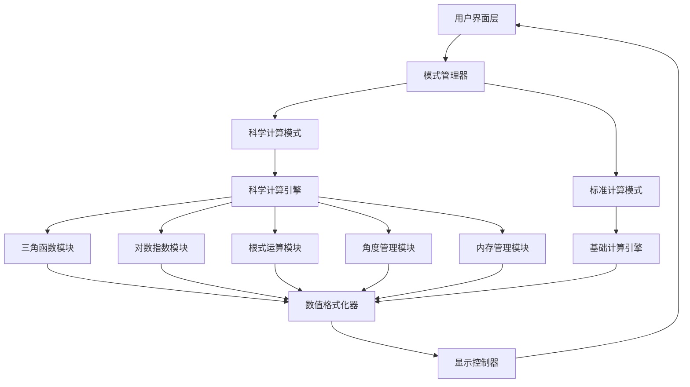
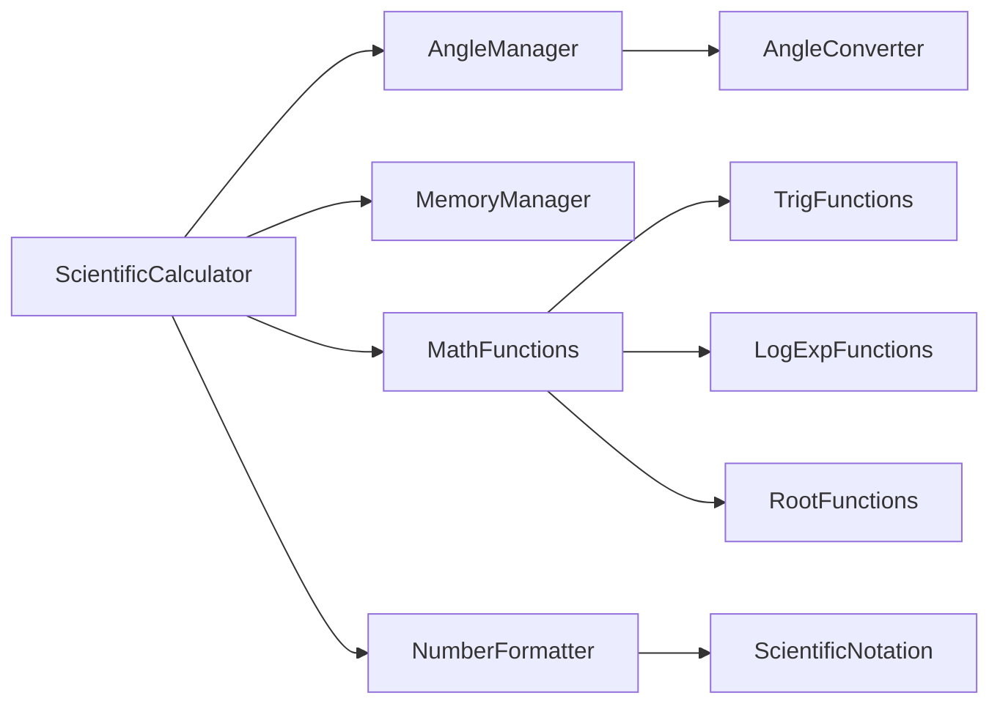
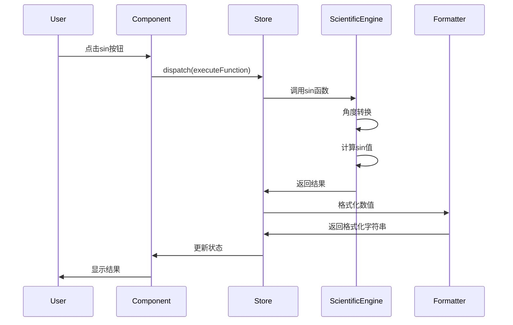
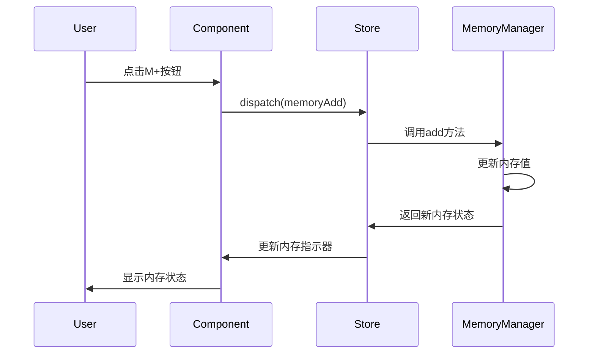

# 科学计算器扩展设计文档

## 1. 系统架构设计

### 1.1 整体架构扩展



### 1.2 模块依赖关系



## 2. 核心模块设计

### 2.1 科学计算引擎 (ScientificCalculator)

```typescript
interface IScientificCalculator {
  // 三角函数
  sin(value: number, angleMode: AngleMode): number;
  cos(value: number, angleMode: AngleMode): number;
  tan(value: number, angleMode: AngleMode): number;
  asin(value: number, angleMode: AngleMode): number;
  acos(value: number, angleMode: AngleMode): number;
  atan(value: number, angleMode: AngleMode): number;
  
  // 双曲三角函数
  sinh(value: number): number;
  cosh(value: number): number;
  tanh(value: number): number;
  
  // 对数函数
  ln(value: number): number;
  log(value: number): number;
  log2(value: number): number;
  logBase(value: number, base: number): number;
  
  // 指数函数
  exp(value: number): number;
  pow10(value: number): number;
  power(base: number, exponent: number): number;
  
  // 根式函数
  sqrt(value: number): number;
  cbrt(value: number): number;
  nthRoot(value: number, n: number): number;
  
  // 其他函数
  factorial(n: number): number;
  percentage(value: number): number;
  reciprocal(value: number): number;
  absolute(value: number): number;
}

class ScientificCalculator implements IScientificCalculator {
  private angleManager: AngleManager;
  private precision: number = 15;
  
  constructor(angleManager: AngleManager) {
    this.angleManager = angleManager;
  }
  
  sin(value: number, angleMode: AngleMode): number {
    const radians = this.angleManager.toRadians(value, angleMode);
    return this.roundToPrecision(Math.sin(radians));
  }
  
  private roundToPrecision(value: number): number {
    return Number(value.toPrecision(this.precision));
  }
}
```

### 2.2 角度管理模块 (AngleManager)

```typescript
enum AngleMode {
  DEGREE = 'DEG',
  RADIAN = 'RAD',
  GRADIAN = 'GRAD'
}

interface IAngleManager {
  currentMode: AngleMode;
  setMode(mode: AngleMode): void;
  toRadians(value: number, mode?: AngleMode): number;
  fromRadians(value: number, mode?: AngleMode): number;
  convert(value: number, from: AngleMode, to: AngleMode): number;
}

class AngleManager implements IAngleManager {
  currentMode: AngleMode = AngleMode.DEGREE;
  
  setMode(mode: AngleMode): void {
    this.currentMode = mode;
  }
  
  toRadians(value: number, mode: AngleMode = this.currentMode): number {
    switch (mode) {
      case AngleMode.DEGREE:
        return value * Math.PI / 180;
      case AngleMode.GRADIAN:
        return value * Math.PI / 200;
      case AngleMode.RADIAN:
      default:
        return value;
    }
  }
  
  fromRadians(value: number, mode: AngleMode = this.currentMode): number {
    switch (mode) {
      case AngleMode.DEGREE:
        return value * 180 / Math.PI;
      case AngleMode.GRADIAN:
        return value * 200 / Math.PI;
      case AngleMode.RADIAN:
      default:
        return value;
    }
  }
}
```

### 2.3 内存管理模块 (MemoryManager)

```typescript
interface IMemoryManager {
  memory: number[];
  store(value: number, slot?: number): void;
  recall(slot?: number): number;
  add(value: number, slot?: number): void;
  subtract(value: number, slot?: number): void;
  clear(slot?: number): void;
  clearAll(): void;
  hasMemory(slot?: number): boolean;
}

class MemoryManager implements IMemoryManager {
  memory: number[] = [0]; // 默认一个内存槽
  
  store(value: number, slot: number = 0): void {
    this.ensureSlot(slot);
    this.memory[slot] = value;
  }
  
  recall(slot: number = 0): number {
    this.ensureSlot(slot);
    return this.memory[slot];
  }
  
  add(value: number, slot: number = 0): void {
    this.ensureSlot(slot);
    this.memory[slot] += value;
  }
  
  subtract(value: number, slot: number = 0): void {
    this.ensureSlot(slot);
    this.memory[slot] -= value;
  }
  
  clear(slot: number = 0): void {
    this.ensureSlot(slot);
    this.memory[slot] = 0;
  }
  
  clearAll(): void {
    this.memory.fill(0);
  }
  
  hasMemory(slot: number = 0): boolean {
    return this.memory[slot] !== 0;
  }
  
  private ensureSlot(slot: number): void {
    while (this.memory.length <= slot) {
      this.memory.push(0);
    }
  }
}
```

### 2.4 数值格式化模块 (NumberFormatter)

```typescript
interface INumberFormatter {
  formatScientific(value: number, precision?: number): string;
  formatStandard(value: number, precision?: number): string;
  parseScientific(input: string): number;
  shouldUseScientific(value: number): boolean;
  formatWithPrecision(value: number, precision: number): string;
}

class NumberFormatter implements INumberFormatter {
  private readonly SCIENTIFIC_THRESHOLD_HIGH = 1e15;
  private readonly SCIENTIFIC_THRESHOLD_LOW = 1e-6;
  private readonly DEFAULT_PRECISION = 15;
  
  formatScientific(value: number, precision: number = this.DEFAULT_PRECISION): string {
    return value.toExponential(precision - 1);
  }
  
  formatStandard(value: number, precision: number = this.DEFAULT_PRECISION): string {
    return Number(value.toPrecision(precision)).toString();
  }
  
  shouldUseScientific(value: number): boolean {
    const absValue = Math.abs(value);
    return absValue >= this.SCIENTIFIC_THRESHOLD_HIGH || 
           (absValue > 0 && absValue < this.SCIENTIFIC_THRESHOLD_LOW);
  }
  
  parseScientific(input: string): number {
    // 解析 1.23E+5 或 1.23e-5 格式
    const scientificRegex = /^([+-]?\d*\.?\d+)[eE]([+-]?\d+)$/;
    const match = input.match(scientificRegex);
    
    if (match) {
      const mantissa = parseFloat(match[1]);
      const exponent = parseInt(match[2]);
      return mantissa * Math.pow(10, exponent);
    }
    
    return parseFloat(input);
  }
}
```

## 3. 状态管理设计

### 3.1 Redux State 扩展

```typescript
interface ScientificCalculatorState extends BasicCalculatorState {
  // 科学计算扩展状态
  angleMode: AngleMode;
  isScientificMode: boolean;
  memory: number[];
  lastFunction: string | null;
  functionHistory: string[];
  precision: number;
  useScientificNotation: boolean;
  constants: Record<string, number>;
}

const initialScientificState: ScientificCalculatorState = {
  ...initialBasicState,
  angleMode: AngleMode.DEGREE,
  isScientificMode: false,
  memory: [0],
  lastFunction: null,
  functionHistory: [],
  precision: 15,
  useScientificNotation: false,
  constants: {
    PI: Math.PI,
    E: Math.E,
    PHI: (1 + Math.sqrt(5)) / 2
  }
};
```

### 3.2 Action Types 扩展

```typescript
enum ScientificActionTypes {
  // 模式控制
  SET_ANGLE_MODE = 'SET_ANGLE_MODE',
  TOGGLE_SCIENTIFIC_MODE = 'TOGGLE_SCIENTIFIC_MODE',
  
  // 函数计算
  EXECUTE_FUNCTION = 'EXECUTE_FUNCTION',
  INSERT_CONSTANT = 'INSERT_CONSTANT',
  
  // 内存操作
  MEMORY_STORE = 'MEMORY_STORE',
  MEMORY_RECALL = 'MEMORY_RECALL',
  MEMORY_ADD = 'MEMORY_ADD',
  MEMORY_SUBTRACT = 'MEMORY_SUBTRACT',
  MEMORY_CLEAR = 'MEMORY_CLEAR',
  
  // 显示控制
  SET_PRECISION = 'SET_PRECISION',
  TOGGLE_SCIENTIFIC_NOTATION = 'TOGGLE_SCIENTIFIC_NOTATION'
}

type ScientificAction = 
  | { type: ScientificActionTypes.SET_ANGLE_MODE; payload: AngleMode }
  | { type: ScientificActionTypes.TOGGLE_SCIENTIFIC_MODE }
  | { type: ScientificActionTypes.EXECUTE_FUNCTION; payload: { func: string; value: number } }
  | { type: ScientificActionTypes.MEMORY_STORE; payload: { value: number; slot?: number } }
  | { type: ScientificActionTypes.SET_PRECISION; payload: number };
```

## 4. 组件设计

### 4.1 科学计算器主组件

```typescript
interface ScientificCalculatorProps {
  isScientificMode: boolean;
  onModeToggle: () => void;
}

const ScientificCalculator: React.FC<ScientificCalculatorProps> = ({
  isScientificMode,
  onModeToggle
}) => {
  return (
    <div className="scientific-calculator">
      <Display />
      <ModeToggle isScientific={isScientificMode} onToggle={onModeToggle} />
      {isScientificMode && <AngleModeSelector />}
      {isScientificMode && <ScientificButtonPanel />}
      <StandardButtonPanel />
      {isScientificMode && <MemoryPanel />}
    </div>
  );
};
```

### 4.2 科学函数按钮面板

```typescript
const ScientificButtonPanel: React.FC = () => {
  const dispatch = useAppDispatch();
  
  const handleFunctionClick = (func: string) => {
    const currentValue = useAppSelector(state => state.calculator.currentValue);
    dispatch(executeFunction({ func, value: parseFloat(currentValue) }));
  };
  
  return (
    <div className="scientific-button-panel">
      <div className="function-row">
        <Button onClick={() => handleFunctionClick('sin')}>sin</Button>
        <Button onClick={() => handleFunctionClick('cos')}>cos</Button>
        <Button onClick={() => handleFunctionClick('tan')}>tan</Button>
        <Button onClick={() => handleFunctionClick('ln')}>ln</Button>
        <Button onClick={() => handleFunctionClick('log')}>log</Button>
      </div>
      <div className="function-row">
        <Button onClick={() => handleFunctionClick('asin')}>sin⁻¹</Button>
        <Button onClick={() => handleFunctionClick('acos')}>cos⁻¹</Button>
        <Button onClick={() => handleFunctionClick('atan')}>tan⁻¹</Button>
        <Button onClick={() => handleFunctionClick('exp')}>eˣ</Button>
        <Button onClick={() => handleFunctionClick('pow10')}>10ˣ</Button>
      </div>
      <div className="constant-row">
        <Button onClick={() => dispatch(insertConstant('PI'))}>π</Button>
        <Button onClick={() => dispatch(insertConstant('E'))}>e</Button>
        <Button onClick={() => handleFunctionClick('square')}>x²</Button>
        <Button onClick={() => handleFunctionClick('sqrt')}>√x</Button>
        <Button onClick={() => handleFunctionClick('factorial')}>x!</Button>
      </div>
    </div>
  );
};
```

### 4.3 角度模式选择器

```typescript
const AngleModeSelector: React.FC = () => {
  const dispatch = useAppDispatch();
  const angleMode = useAppSelector(state => state.calculator.angleMode);
  
  return (
    <div className="angle-mode-selector">
      {Object.values(AngleMode).map(mode => (
        <Button
          key={mode}
          className={angleMode === mode ? 'active' : ''}
          onClick={() => dispatch(setAngleMode(mode))}
        >
          {mode}
        </Button>
      ))}
    </div>
  );
};
```

## 5. 数据流设计

### 5.1 科学函数计算流程



### 5.2 内存操作流程



## 6. 错误处理设计

### 6.1 数学错误处理

```typescript
class MathError extends Error {
  constructor(
    message: string,
    public readonly errorType: 'DOMAIN_ERROR' | 'OVERFLOW' | 'UNDERFLOW' | 'DIVISION_BY_ZERO'
  ) {
    super(message);
    this.name = 'MathError';
  }
}

const errorHandler = {
  handleDomainError: (func: string, value: number): never => {
    throw new MathError(`${func}(${value}) 超出定义域`, 'DOMAIN_ERROR');
  },
  
  handleOverflow: (result: number): never => {
    throw new MathError('计算结果溢出', 'OVERFLOW');
  },
  
  handleDivisionByZero: (): never => {
    throw new MathError('除零错误', 'DIVISION_BY_ZERO');
  }
};
```

### 6.2 输入验证

```typescript
const inputValidator = {
  validateNumber: (input: string): boolean => {
    const numberRegex = /^[+-]?(\d+\.?\d*|\.\d+)([eE][+-]?\d+)?$/;
    return numberRegex.test(input);
  },
  
  validateFunction: (func: string): boolean => {
    const validFunctions = ['sin', 'cos', 'tan', 'ln', 'log', 'sqrt', 'exp'];
    return validFunctions.includes(func);
  },
  
  validateRange: (value: number, min: number, max: number): boolean => {
    return value >= min && value <= max;
  }
};
```

## 7. 性能优化设计

### 7.1 计算缓存

```typescript
class CalculationCache {
  private cache = new Map<string, number>();
  private maxSize = 1000;
  
  get(key: string): number | undefined {
    return this.cache.get(key);
  }
  
  set(key: string, value: number): void {
    if (this.cache.size >= this.maxSize) {
      const firstKey = this.cache.keys().next().value;
      this.cache.delete(firstKey);
    }
    this.cache.set(key, value);
  }
  
  generateKey(func: string, value: number, angleMode?: AngleMode): string {
    return `${func}_${value}_${angleMode || ''}`;
  }
}
```

### 7.2 懒加载设计

```typescript
const ScientificButtonPanel = React.lazy(() => import('./ScientificButtonPanel'));
const MemoryPanel = React.lazy(() => import('./MemoryPanel'));

const ScientificCalculator: React.FC = () => {
  const isScientificMode = useAppSelector(state => state.calculator.isScientificMode);
  
  return (
    <div className="calculator">
      <Display />
      {isScientificMode && (
        <Suspense fallback={<div>Loading...</div>}>
          <ScientificButtonPanel />
          <MemoryPanel />
        </Suspense>
      )}
      <StandardButtonPanel />
    </div>
  );
};
```

## 8. 测试策略

### 8.1 单元测试覆盖

- 科学函数计算精度测试
- 角度转换准确性测试
- 内存操作功能测试
- 数值格式化测试
- 错误处理测试

### 8.2 集成测试

- 模式切换功能测试
- 状态管理集成测试
- 组件交互测试

### 8.3 端到端测试

- 完整计算流程测试
- 跨浏览器兼容性测试
- 响应式布局测试
