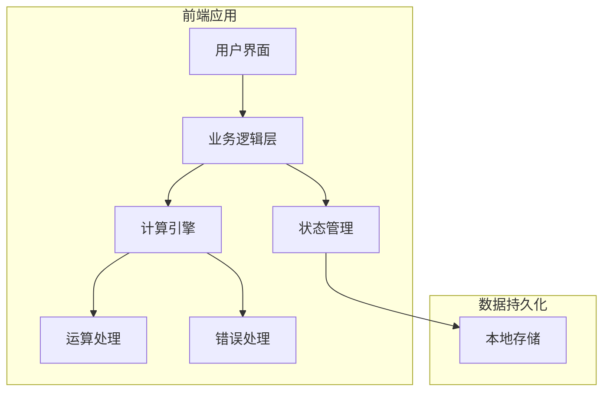
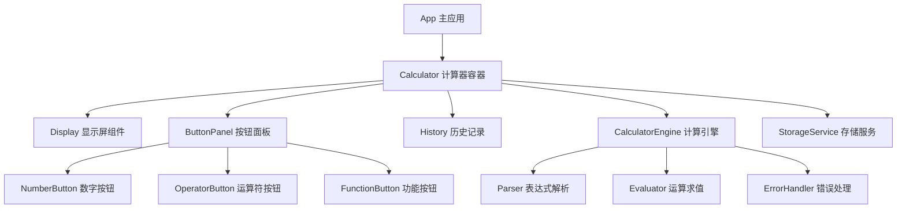
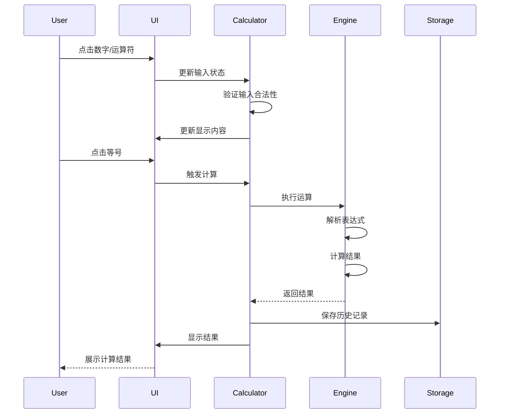
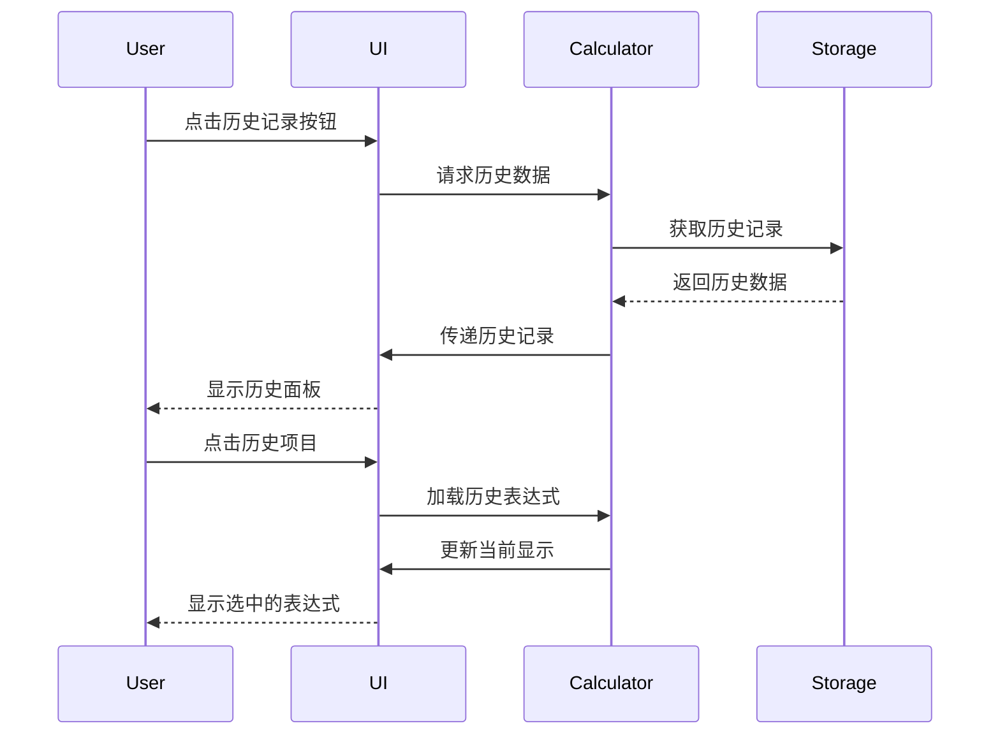

# 【计算器】概要设计

## 一、概述

本文档旨在为计算器软件项目提供详细的前端设计方案。该软件是一个跨平台的计算器应用，支持基本数学运算、历史记录等功能，同时提供PC端和移动端的良好用户体验。

## 二、可行性分析

### 2.1 需求分析

根据需求文档，核心功能点如下：

- 基本四则运算功能
- 数字和运算符输入
- 清除和重置功能
- 历史记录管理
- 跨平台兼容性

| 产品需求 | 需求拆解 | 实施分块 |
| :------: | :------: | :------: |
| 基本运算 | 实现加减乘除运算逻辑，支持连续运算和运算优先级 | 核心计算引擎模块 |
| 界面交互 | 响应式UI设计，支持键盘和触摸输入 | UI组件模块 |
| 历史记录 | 本地存储运算历史，支持查看和清除 | 数据存储模块 |
| 错误处理 | 处理除零、溢出等异常情况 | 异常处理模块 |

### 2.2 技术选型

- **前端框架**: React 18+ (支持并发特性)
- **状态管理**: Redux Toolkit (简化状态管理)
- **UI组件库**: Ant Design (PC端) + Ant Design Mobile (移动端)
- **样式方案**: CSS Modules + Styled Components
- **构建工具**: Vite (快速构建和热更新)
- **类型检查**: TypeScript (类型安全)
- **测试框架**: Jest + React Testing Library

## 三、解决方案

### 3.1 系统架构

项目采用模块化的React架构，按功能划分为以下层次：

1. **展示层**: UI组件和页面布局
2. **业务逻辑层**: 计算引擎和状态管理
3. **数据层**: 本地存储和数据持久化
4. **工具层**: 工具函数和常量定义



### 3.2 模块设计



### 3.3 核心组件设计

#### 3.3.1 Calculator 主组件

```typescript
interface CalculatorState {
  display: string;           // 当前显示内容
  expression: string;        // 当前表达式
  history: HistoryItem[];    // 历史记录
  isError: boolean;          // 错误状态
  lastOperator: string;      // 最后操作符
}

interface CalculatorProps {
  theme?: 'light' | 'dark';  // 主题模式
  precision?: number;        // 计算精度
}
```

#### 3.3.2 计算引擎设计

```typescript
class CalculatorEngine {
  private precision: number = 15;
  
  // 执行计算
  calculate(expression: string): CalculationResult;
  
  // 解析表达式
  parseExpression(input: string): ParsedExpression;
  
  // 求值运算
  evaluate(tokens: Token[]): number;
  
  // 错误处理
  handleError(error: CalculatorError): string;
}
```

### 3.4 时序图

#### 3.4.1 基本运算流程



#### 3.4.2 历史记录查看流程



### 3.5 数据结构设计

#### 3.5.1 历史记录结构

```typescript
interface HistoryItem {
  id: string;
  expression: string;
  result: string;
  timestamp: number;
  isError: boolean;
}
```

#### 3.5.2 计算结果结构

```typescript
interface CalculationResult {
  value: number;
  formatted: string;
  isError: boolean;
  errorMessage?: string;
}
```

### 3.6 错误处理策略

1. **输入验证**: 防止无效字符输入
2. **运算异常**: 处理除零、溢出等情况
3. **精度控制**: 避免浮点数精度问题
4. **用户友好**: 提供清晰的错误提示

### 3.7 性能优化

1. **组件优化**: 使用React.memo和useMemo减少重渲染
2. **计算优化**: 缓存复杂运算结果
3. **存储优化**: 限制历史记录数量，定期清理
4. **包体积优化**: 按需加载，代码分割

## 四、实施计划

### 4.1 开发阶段

1. **第一阶段**: 核心计算功能实现
2. **第二阶段**: UI界面开发
3. **第三阶段**: 历史记录功能
4. **第四阶段**: 响应式适配和优化
5. **第五阶段**: 测试和部署

### 4.2 技术风险

1. **浮点数精度**: 使用decimal.js库处理精度问题
2. **跨平台兼容**: 充分测试各平台表现
3. **性能瓶颈**: 监控和优化关键路径

## 五、总结

本设计方案采用现代前端技术栈，确保计算器软件具有良好的可维护性、扩展性和用户体验。通过模块化设计和清晰的架构分层，为后续功能扩展和维护提供了坚实基础。
