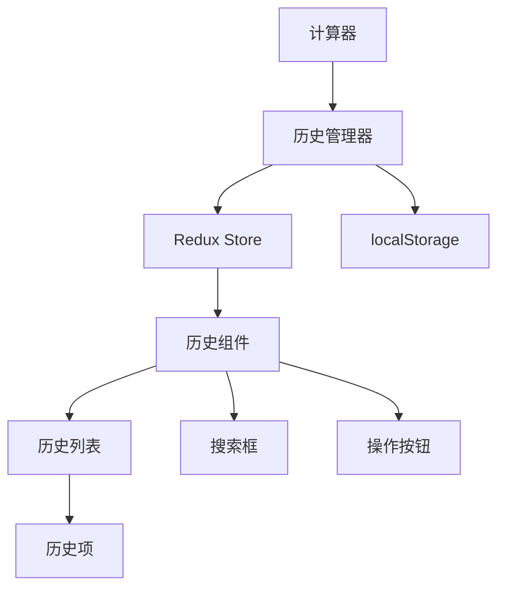

# 【计算器-历史记录】概要设计

## 一、概述

本文档为计算器应用的历史记录功能提供详细的技术设计方案。该功能将支持计算历史的保存、查看、重用和管理，提升用户的计算效率和体验。

## 二、可行性分析

### 2.1 需求分析

| 产品需求 | 需求拆解 | 实施分块 |
| :------: | :------: | :------: |
| 历史保存 | 自动保存每次计算结果，包含表达式和结果 | 历史存储模块 |
| 历史显示 | 以列表形式展示历史记录，支持滚动查看 | 历史展示模块 |
| 历史重用 | 点击历史项快速填入当前计算 | 历史交互模块 |
| 历史管理 | 支持删除单条、清空全部、搜索功能 | 历史管理模块 |

### 2.2 技术选型

- **localStorage**: 本地持久化存储历史数据
- **Redux**: 历史状态管理
- **React Virtual**: 大量数据虚拟滚动优化
- **Fuse.js**: 模糊搜索功能
- **CSS Grid**: 历史项布局

## 三、解决方案

### 3.1 系统架构



### 3.2 核心模块设计

#### 3.2.1 历史管理器 (HistoryManager)

```typescript
interface HistoryManager {
  history: HistoryItem[];
  
  // 历史操作
  addHistory(expression: string, result: string): void;
  deleteHistory(id: string): void;
  clearHistory(): void;
  
  // 历史查询
  getHistory(): HistoryItem[];
  searchHistory(query: string): HistoryItem[];
  
  // 持久化
  saveHistory(): void;
  loadHistory(): HistoryItem[];
}

interface HistoryItem {
  id: string;
  expression: string;
  result: string;
  timestamp: number;
}
```

#### 3.2.2 Redux状态管理

```typescript
interface HistoryState {
  items: HistoryItem[];
  searchQuery: string;
  isVisible: boolean;
}

const historySlice = createSlice({
  name: 'history',
  initialState: {
    items: [],
    searchQuery: '',
    isVisible: false
  },
  reducers: {
    addHistoryItem: (state, action: PayloadAction<Omit<HistoryItem, 'id'>>) => {
      const newItem = {
        ...action.payload,
        id: generateId()
      };
      state.items.unshift(newItem);
      if (state.items.length > 50) {
        state.items = state.items.slice(0, 50);
      }
    },
    deleteHistoryItem: (state, action: PayloadAction<string>) => {
      state.items = state.items.filter(item => item.id !== action.payload);
    },
    clearHistory: (state) => {
      state.items = [];
    },
    setSearchQuery: (state, action: PayloadAction<string>) => {
      state.searchQuery = action.payload;
    },
    toggleHistoryPanel: (state) => {
      state.isVisible = !state.isVisible;
    }
  }
});
```

#### 3.2.3 历史面板组件

```typescript
interface HistoryPanelProps {
  isVisible: boolean;
  onItemClick: (item: HistoryItem) => void;
}

export const HistoryPanel: React.FC<HistoryPanelProps> = ({ 
  isVisible, 
  onItemClick 
}) => {
  const dispatch = useDispatch();
  const { items, searchQuery } = useSelector((state: RootState) => state.history);
  
  const filteredItems = useMemo(() => {
    if (!searchQuery) return items;
    return items.filter(item => 
      item.expression.includes(searchQuery) || 
      item.result.includes(searchQuery)
    );
  }, [items, searchQuery]);

  return (
    <div className={`history-panel ${isVisible ? 'visible' : 'hidden'}`}>
      <div className="history-header">
        <h3>历史记录 ({items.length})</h3>
        <button onClick={() => dispatch(clearHistory())}>清空</button>
      </div>
      
      <input
        type="text"
        placeholder="搜索历史..."
        value={searchQuery}
        onChange={(e) => dispatch(setSearchQuery(e.target.value))}
      />
      
      <div className="history-list">
        {filteredItems.map(item => (
          <HistoryItem
            key={item.id}
            item={item}
            onClick={() => onItemClick(item)}
            onDelete={() => dispatch(deleteHistoryItem(item.id))}
          />
        ))}
      </div>
    </div>
  );
};
```

### 3.3 界面设计

#### 3.3.1 历史面板布局

```
┌─────────────────────────────────────┐
│ 历史记录 (15)              [清空]    │
├─────────────────────────────────────┤
│ [🔍] 搜索历史...                     │
├─────────────────────────────────────┤
│ 2 + 3 × 4                      [×]  │
│ = 14                                │
│ 2分钟前                              │
├─────────────────────────────────────┤
│ √(16) + 5²                     [×]  │
│ = 29                                │
│ 5分钟前                              │
└─────────────────────────────────────┘
```

#### 3.3.2 CSS样式定义

```css
.history-panel {
  width: 300px;
  height: 100%;
  background: var(--bg-secondary);
  border-left: 1px solid var(--border-color);
  display: flex;
  flex-direction: column;
  transform: translateX(100%);
  transition: transform 0.3s ease;
}

.history-panel.visible {
  transform: translateX(0);
}

.history-item {
  padding: 12px;
  border-bottom: 1px solid var(--border-color);
  cursor: pointer;
  transition: background-color 0.2s ease;
}

.history-item:hover {
  background: var(--button-hover);
}

.history-expression {
  font-size: 14px;
  color: var(--text-secondary);
  margin-bottom: 4px;
}

.history-result {
  font-size: 18px;
  font-weight: bold;
  color: var(--text-primary);
  text-align: right;
}

.history-time {
  font-size: 12px;
  color: var(--text-secondary);
  margin-top: 4px;
}
```

### 3.4 数据流设计

#### 3.4.1 历史保存流程

```
用户完成计算
    ↓
dispatch(addHistoryItem({expression, result}))
    ↓
Redux更新state.history.items
    ↓
useEffect监听items变化
    ↓
调用saveToLocalStorage(items)
    ↓
数据持久化到localStorage
```

#### 3.4.2 历史重用流程

```
用户点击历史项
    ↓
onItemClick(item)回调触发
    ↓
Calculator组件接收item数据
    ↓
更新输入框内容为item.expression
    ↓
用户可继续编辑或直接计算
```

### 3.5 算法实现

#### 3.5.1 历史搜索

```typescript
class HistorySearcher {
  static searchItems(items: HistoryItem[], query: string): HistoryItem[] {
    if (!query.trim()) return items;
    
    const lowerQuery = query.toLowerCase();
    return items.filter(item => 
      item.expression.toLowerCase().includes(lowerQuery) ||
      item.result.toLowerCase().includes(lowerQuery)
    );
  }
  
  static highlightMatch(text: string, query: string): string {
    if (!query) return text;
    
    const regex = new RegExp(`(${query})`, 'gi');
    return text.replace(regex, '<mark>$1</mark>');
  }
}
```

#### 3.5.2 数据持久化

```typescript
class HistoryStorage {
  private static readonly STORAGE_KEY = 'calculator-history';
  private static readonly MAX_ITEMS = 50;
  
  static save(items: HistoryItem[]): void {
    const trimmedItems = items.slice(0, this.MAX_ITEMS);
    localStorage.setItem(this.STORAGE_KEY, JSON.stringify(trimmedItems));
  }
  
  static load(): HistoryItem[] {
    try {
      const stored = localStorage.getItem(this.STORAGE_KEY);
      return stored ? JSON.parse(stored) : [];
    } catch {
      return [];
    }
  }
  
  static clear(): void {
    localStorage.removeItem(this.STORAGE_KEY);
  }
}
```

## 四、实施计划

### 4.1 开发阶段

**阶段一：数据层 (1.5小时)**
- 创建HistoryItem接口
- 实现historySlice
- 实现localStorage存储

**阶段二：UI组件 (2小时)**
- 创建HistoryPanel组件
- 创建HistoryItem组件
- 实现搜索功能

**阶段三：集成 (1小时)**
- 集成到Calculator组件
- 实现历史保存逻辑
- 实现历史重用逻辑

**阶段四：优化 (0.5小时)**
- 添加虚拟滚动
- 性能优化
- 样式调整

### 4.2 技术风险与对策

**风险1：大量历史数据性能问题**
- 对策：使用虚拟滚动，限制最大条数

**风险2：localStorage容量限制**
- 对策：自动清理旧数据，压缩存储格式

**风险3：搜索性能问题**
- 对策：使用防抖，限制搜索频率

## 五、测试策略

### 5.1 单元测试
- historySlice reducers测试
- 搜索算法测试
- 存储功能测试

### 5.2 组件测试
- HistoryPanel渲染测试
- 历史项点击测试
- 搜索功能测试

### 5.3 集成测试
- 历史保存和加载测试
- 历史重用功能测试
- 性能压力测试
