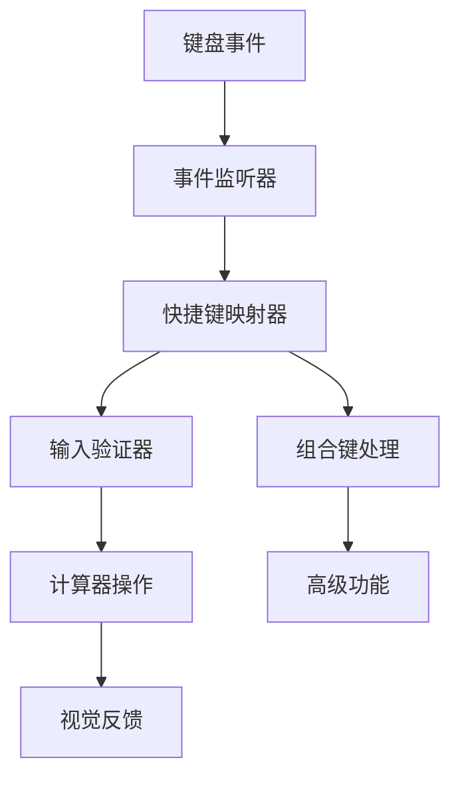

# 【计算器-键盘快捷键】概要设计

## 一、概述

本文档为计算器应用的键盘快捷键功能提供详细的技术设计方案。该功能将支持完整的键盘操作，包括数字输入、运算符操作、功能快捷键和高级组合键，提升桌面端用户的操作效率。

## 二、可行性分析

### 2.1 需求分析

| 产品需求 | 需求拆解 | 实施分块 |
| :------: | :------: | :------: |
| 键盘输入 | 监听键盘事件，映射到计算器操作 | 键盘事件模块 |
| 快捷键映射 | 建立按键与功能的对应关系 | 快捷键映射模块 |
| 视觉反馈 | 按键时对应按钮高亮显示 | 视觉反馈模块 |
| 输入验证 | 过滤和验证键盘输入内容 | 输入验证模块 |

### 2.2 技术选型

- **addEventListener**: 监听键盘事件
- **KeyboardEvent**: 获取按键信息
- **React useEffect**: 管理事件监听器生命周期
- **CSS类切换**: 实现按钮高亮效果
- **正则表达式**: 验证输入内容

## 三、解决方案

### 3.1 系统架构



### 3.2 核心模块设计

#### 3.2.1 键盘事件管理器 (KeyboardManager)

```typescript
interface KeyboardManager {
  keyMap: Map<string, () => void>;
  
  // 事件管理
  addKeyListener(): void;
  removeKeyListener(): void;
  handleKeyDown(event: KeyboardEvent): void;
  
  // 快捷键映射
  registerShortcut(key: string, callback: () => void): void;
  unregisterShortcut(key: string): void;
  
  // 组合键处理
  handleCombination(event: KeyboardEvent): boolean;
  
  // 视觉反馈
  highlightButton(key: string): void;
  removeHighlight(key: string): void;
}
```

#### 3.2.2 快捷键映射配置

```typescript
interface ShortcutConfig {
  // 数字键映射
  digits: {
    '0': () => void;
    '1': () => void;
    '2': () => void;
    '3': () => void;
    '4': () => void;
    '5': () => void;
    '6': () => void;
    '7': () => void;
    '8': () => void;
    '9': () => void;
    '.': () => void;
  };
  
  // 运算符映射
  operators: {
    '+': () => void;
    '-': () => void;
    '*': () => void;
    '/': () => void;
  };
  
  // 功能键映射
  functions: {
    'Enter': () => void;
    'Escape': () => void;
    'Backspace': () => void;
  };
  
  // 组合键映射
  combinations: {
    'Ctrl+C': () => void;
    'Ctrl+V': () => void;
    'Ctrl+H': () => void;
    'Ctrl+T': () => void;
  };
}
```

#### 3.2.3 键盘快捷键Hook

```typescript
export const useKeyboardShortcuts = (calculatorRef: RefObject<HTMLDivElement>) => {
  const dispatch = useDispatch();
  const { display, expression } = useSelector((state: RootState) => state.calculator);
  
  const keyMap = useMemo(() => ({
    // 数字键
    '0': () => dispatch(inputDigit('0')),
    '1': () => dispatch(inputDigit('1')),
    '2': () => dispatch(inputDigit('2')),
    '3': () => dispatch(inputDigit('3')),
    '4': () => dispatch(inputDigit('4')),
    '5': () => dispatch(inputDigit('5')),
    '6': () => dispatch(inputDigit('6')),
    '7': () => dispatch(inputDigit('7')),
    '8': () => dispatch(inputDigit('8')),
    '9': () => dispatch(inputDigit('9')),
    '.': () => dispatch(inputDecimal()),
    
    // 运算符
    '+': () => dispatch(inputOperator('+')),
    '-': () => dispatch(inputOperator('-')),
    '*': () => dispatch(inputOperator('×')),
    '/': () => dispatch(inputOperator('÷')),
    
    // 功能键
    'Enter': () => dispatch(calculate()),
    'Escape': () => dispatch(clear()),
    'Backspace': () => dispatch(deleteLast()),
  }), [dispatch]);

  const handleKeyDown = useCallback((event: KeyboardEvent) => {
    // 处理组合键
    if (event.ctrlKey || event.metaKey) {
      handleCombinationKey(event);
      return;
    }
    
    // 处理单键
    const key = event.key;
    const handler = keyMap[key];
    
    if (handler) {
      event.preventDefault();
      handler();
      highlightButton(key);
    }
  }, [keyMap]);

  useEffect(() => {
    const element = calculatorRef.current;
    if (!element) return;
    
    element.addEventListener('keydown', handleKeyDown);
    element.focus(); // 确保焦点在计算器上
    
    return () => {
      element.removeEventListener('keydown', handleKeyDown);
    };
  }, [handleKeyDown]);
};
```

### 3.3 界面设计

#### 3.3.1 按钮高亮效果

```css
.calculator-button {
  transition: all 0.1s ease;
  position: relative;
}

.calculator-button.keyboard-active {
  background-color: var(--button-active);
  transform: scale(0.95);
  box-shadow: inset 0 2px 4px rgba(0, 0, 0, 0.2);
}

.calculator-button::after {
  content: attr(data-shortcut);
  position: absolute;
  bottom: 2px;
  right: 4px;
  font-size: 10px;
  color: var(--text-secondary);
  opacity: 0.7;
}

.calculator-button:hover::after {
  opacity: 1;
}
```

#### 3.3.2 快捷键提示

```typescript
const ButtonWithShortcut: React.FC<{
  children: React.ReactNode;
  shortcut?: string;
  onClick: () => void;
}> = ({ children, shortcut, onClick }) => {
  return (
    <button
      className="calculator-button"
      data-shortcut={shortcut}
      onClick={onClick}
      title={shortcut ? `快捷键: ${shortcut}` : undefined}
    >
      {children}
    </button>
  );
};
```

### 3.4 数据流设计

#### 3.4.1 键盘事件处理流程

```
键盘按下
    ↓
事件监听器捕获
    ↓
判断是否为组合键
    ↓
查找快捷键映射
    ↓
执行对应操作
    ↓
触发视觉反馈
    ↓
更新计算器状态
```

#### 3.4.2 组合键处理流程

```
Ctrl/Cmd + 按键
    ↓
阻止默认行为
    ↓
识别组合键类型
    ↓
执行高级功能
    ↓
(复制/粘贴/历史/主题)
```

### 3.5 算法实现

#### 3.5.1 按键映射算法

```typescript
class KeyMapper {
  private static readonly KEY_ALIASES: Record<string, string> = {
    'NumpadEnter': 'Enter',
    'Numpad0': '0',
    'Numpad1': '1',
    'Numpad2': '2',
    'Numpad3': '3',
    'Numpad4': '4',
    'Numpad5': '5',
    'Numpad6': '6',
    'Numpad7': '7',
    'Numpad8': '8',
    'Numpad9': '9',
    'NumpadDecimal': '.',
    'NumpadAdd': '+',
    'NumpadSubtract': '-',
    'NumpadMultiply': '*',
    'NumpadDivide': '/',
  };
  
  static normalizeKey(event: KeyboardEvent): string {
    const key = event.key;
    return this.KEY_ALIASES[key] || key;
  }
  
  static getCombinationKey(event: KeyboardEvent): string | null {
    const modifiers = [];
    if (event.ctrlKey || event.metaKey) modifiers.push('Ctrl');
    if (event.shiftKey) modifiers.push('Shift');
    if (event.altKey) modifiers.push('Alt');
    
    if (modifiers.length === 0) return null;
    
    const key = this.normalizeKey(event);
    return `${modifiers.join('+')}+${key}`;
  }
}
```

#### 3.5.2 输入验证算法

```typescript
class InputValidator {
  static isValidNumber(input: string): boolean {
    return /^[0-9]$/.test(input);
  }
  
  static isValidOperator(input: string): boolean {
    return /^[+\-*/]$/.test(input);
  }
  
  static isValidDecimal(input: string): boolean {
    return input === '.';
  }
  
  static validatePasteContent(content: string): string | null {
    // 清理粘贴内容，只保留数字和小数点
    const cleaned = content.replace(/[^0-9.]/g, '');
    
    // 验证是否为有效数字
    if (/^\d*\.?\d*$/.test(cleaned) && cleaned !== '') {
      return cleaned;
    }
    
    return null;
  }
}
```

#### 3.5.3 视觉反馈管理

```typescript
class VisualFeedback {
  private static activeButtons = new Set<string>();
  
  static highlightButton(key: string): void {
    const button = document.querySelector(`[data-key="${key}"]`);
    if (button) {
      button.classList.add('keyboard-active');
      this.activeButtons.add(key);
      
      // 自动移除高亮
      setTimeout(() => {
        this.removeHighlight(key);
      }, 150);
    }
  }
  
  static removeHighlight(key: string): void {
    const button = document.querySelector(`[data-key="${key}"]`);
    if (button) {
      button.classList.remove('keyboard-active');
      this.activeButtons.delete(key);
    }
  }
  
  static clearAllHighlights(): void {
    this.activeButtons.forEach(key => {
      this.removeHighlight(key);
    });
  }
}
```

## 四、实施计划

### 4.1 开发阶段

**阶段一：基础键盘支持 (1.5小时)**
- 实现基础键盘事件监听
- 创建快捷键映射配置
- 实现数字和运算符输入

**阶段二：功能键支持 (1小时)**
- 实现Enter、Escape、Backspace功能
- 添加按键验证逻辑
- 处理数字键盘兼容性

**阶段三：组合键和高级功能 (1小时)**
- 实现Ctrl+C/V复制粘贴
- 实现Ctrl+H历史面板切换
- 实现Ctrl+T主题切换

**阶段四：视觉反馈和优化 (0.5小时)**
- 添加按钮高亮效果
- 实现快捷键提示
- 性能优化和测试

### 4.2 技术风险与对策

**风险1：浏览器快捷键冲突**
- 对策：使用preventDefault()阻止默认行为

**风险2：输入法干扰**
- 对策：监听keydown事件而非keypress

**风险3：焦点管理问题**
- 对策：确保计算器容器始终可获得焦点

## 五、测试策略

### 5.1 单元测试
- 快捷键映射函数测试
- 输入验证算法测试
- 组合键识别测试

### 5.2 集成测试
- 键盘输入端到端测试
- 视觉反馈测试
- 浏览器兼容性测试

### 5.3 用户体验测试
- 快捷键响应速度测试
- 连续按键处理测试
- 错误输入处理测试
