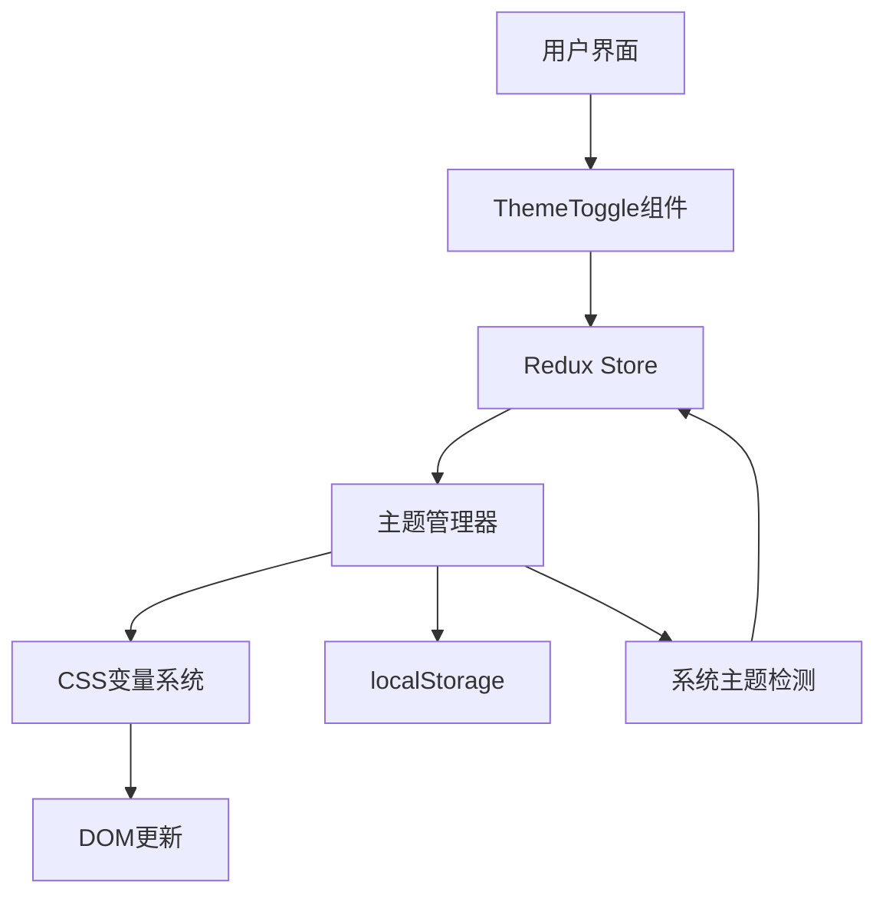

# 【计算器-主题切换】概要设计

## 一、概述

本文档为计算器应用的主题切换功能提供详细的技术设计方案。该功能将支持深色/浅色主题切换，系统主题跟随，以及用户偏好持久化，提升用户在不同场景下的使用体验。

## 二、可行性分析

### 2.1 需求分析

| 产品需求 | 需求拆解 | 实施分块 |
| :------: | :------: | :------: |
| 主题切换 | 实现深色/浅色主题切换，支持一键切换 | 主题管理模块 |
| 系统跟随 | 检测系统主题偏好，自动应用主题 | 系统检测模块 |
| 主题持久化 | 保存用户主题选择，跨会话保持 | 存储管理模块 |
| 主题适配 | 所有组件样式适配两种主题 | 样式系统模块 |

### 2.2 技术选型

- **CSS变量**: 实现主题切换的核心技术
- **localStorage**: 持久化存储用户主题选择
- **matchMedia API**: 检测系统主题偏好
- **Redux**: 主题状态管理
- **CSS Transitions**: 主题切换过渡动画

## 三、解决方案

### 3.1 系统架构



### 3.2 核心模块设计

#### 3.2.1 主题管理器 (ThemeManager)

```typescript
interface ThemeManager {
  currentTheme: 'light' | 'dark';
  isAuto: boolean;
  
  // 主题操作
  setTheme(theme: 'light' | 'dark'): void;
  toggleTheme(): void;
  applyTheme(theme: 'light' | 'dark'): void;
  
  // 系统主题
  getSystemTheme(): 'light' | 'dark';
  watchSystemTheme(callback: (theme: 'light' | 'dark') => void): () => void;
  
  // 持久化
  saveTheme(theme: 'light' | 'dark' | 'auto'): void;
  loadTheme(): 'light' | 'dark' | 'auto';
}
```

#### 3.2.2 Redux状态管理

```typescript
interface ThemeState {
  mode: 'light' | 'dark';
  isAuto: boolean;
}

const themeSlice = createSlice({
  name: 'theme',
  initialState: {
    mode: 'light' as 'light' | 'dark',
    isAuto: false
  },
  reducers: {
    toggleTheme: (state) => {
      state.mode = state.mode === 'light' ? 'dark' : 'light';
      state.isAuto = false;
    },
    setTheme: (state, action: PayloadAction<'light' | 'dark'>) => {
      state.mode = action.payload;
      state.isAuto = false;
    },
    setAutoTheme: (state, action: PayloadAction<boolean>) => {
      state.isAuto = action.payload;
    }
  }
});
```

#### 3.2.3 ThemeToggle组件

```typescript
interface ThemeToggleProps {}

export const ThemeToggle: React.FC<ThemeToggleProps> = () => {
  const dispatch = useDispatch();
  const { mode } = useSelector((state: RootState) => state.theme);

  const handleToggle = () => {
    dispatch(toggleTheme());
  };

  return (
    <button 
      className="theme-toggle"
      onClick={handleToggle}
      aria-label={`切换到${mode === 'light' ? '深色' : '浅色'}模式`}
    >
      {mode === 'light' ? <SunIcon /> : <MoonIcon />}
    </button>
  );
};
```

### 3.3 界面设计

#### 3.3.1 主题切换按钮布局

```
┌─────────────────────────────────────┐
│ 计算器                               │
│                    [标准/科学] [🌙]  │ ← 主题切换按钮
├─────────────────────────────────────┤
│ 显示屏                               │
│ ...                                 │
└─────────────────────────────────────┘
```

#### 3.3.2 CSS变量定义

```css
:root[data-theme="light"] {
  --bg-primary: #ffffff;
  --bg-secondary: #f5f5f5;
  --text-primary: #333333;
  --text-secondary: #666666;
  --button-bg: #e0e0e0;
  --button-text: #333333;
  --button-hover: #d0d0d0;
  --operator-bg: #ff9500;
  --operator-text: #ffffff;
  --equals-bg: #4caf50;
  --equals-text: #ffffff;
  --border-color: #e0e0e0;
  --shadow: rgba(0, 0, 0, 0.1);
}

:root[data-theme="dark"] {
  --bg-primary: #1e1e1e;
  --bg-secondary: #2d2d2d;
  --text-primary: #ffffff;
  --text-secondary: #b0b0b0;
  --button-bg: #3a3a3a;
  --button-text: #ffffff;
  --button-hover: #4a4a4a;
  --operator-bg: #ff9f0a;
  --operator-text: #000000;
  --equals-bg: #30d158;
  --equals-text: #000000;
  --border-color: #3a3a3a;
  --shadow: rgba(0, 0, 0, 0.3);
}
```

#### 3.3.3 过渡动画

```css
* {
  transition: background-color 0.3s ease, 
              color 0.3s ease,
              border-color 0.3s ease;
}

.theme-toggle {
  transition: transform 0.3s ease;
}

.theme-toggle:active {
  transform: scale(0.9);
}

.theme-toggle svg {
  transition: transform 0.3s ease;
}

.theme-toggle.switching svg {
  transform: rotate(180deg);
}
```

### 3.4 数据流设计

#### 3.4.1 主题切换流程

```
用户点击按钮
    ↓
dispatch(toggleTheme())
    ↓
Redux更新state.theme.mode
    ↓
useEffect监听mode变化
    ↓
调用applyTheme(mode)
    ↓
设置document.documentElement.dataset.theme
    ↓
CSS变量生效，界面更新
    ↓
保存到localStorage
```

#### 3.4.2 初始化流程

```
应用启动
    ↓
从localStorage读取主题设置
    ↓
如果是'auto'，检测系统主题
    ↓
应用主题到DOM
    ↓
初始化Redux state
    ↓
监听系统主题变化
```

### 3.5 算法实现

#### 3.5.1 系统主题检测

```typescript
class ThemeDetector {
  static getSystemTheme(): 'light' | 'dark' {
    if (window.matchMedia && 
        window.matchMedia('(prefers-color-scheme: dark)').matches) {
      return 'dark';
    }
    return 'light';
  }
  
  static watchSystemTheme(callback: (theme: 'light' | 'dark') => void): () => void {
    const mediaQuery = window.matchMedia('(prefers-color-scheme: dark)');
    
    const handler = (e: MediaQueryListEvent) => {
      callback(e.matches ? 'dark' : 'light');
    };
    
    mediaQuery.addEventListener('change', handler);
    
    return () => mediaQuery.removeEventListener('change', handler);
  }
}
```

#### 3.5.2 主题应用

```typescript
class ThemeApplicator {
  static applyTheme(theme: 'light' | 'dark'): void {
    document.documentElement.setAttribute('data-theme', theme);
  }
  
  static saveTheme(theme: 'light' | 'dark' | 'auto'): void {
    localStorage.setItem('calculator-theme', theme);
  }
  
  static loadTheme(): 'light' | 'dark' | 'auto' {
    const saved = localStorage.getItem('calculator-theme');
    if (saved === 'light' || saved === 'dark' || saved === 'auto') {
      return saved;
    }
    return 'auto';
  }
}
```

#### 3.5.3 兼容性处理

```typescript
class ThemeCompatibility {
  static supportsCSSVariables(): boolean {
    return window.CSS && 
           window.CSS.supports && 
           window.CSS.supports('--test', '0');
  }
  
  static applyThemeFallback(theme: 'light' | 'dark'): void {
    // 降级方案：使用类名
    document.body.className = `theme-${theme}`;
  }
}
```

## 四、实施计划

### 4.1 开发阶段

**阶段一：基础设施 (2小时)**
- 创建CSS变量定义
- 实现主题管理器
- 创建Redux切片

**阶段二：UI组件 (1.5小时)**
- 创建ThemeToggle组件
- 添加图标和样式
- 集成到Calculator组件

**阶段三：功能集成 (1.5小时)**
- 实现主题切换逻辑
- 实现持久化存储
- 实现系统主题检测

**阶段四：样式适配 (1小时)**
- 更新所有组件CSS
- 测试两种主题显示
- 调整配色和对比度

### 4.2 技术风险与对策

**风险1：CSS变量兼容性**
- 对策：提供类名切换降级方案

**风险2：主题切换闪烁**
- 对策：在HTML加载前注入主题脚本

**风险3：第三方组件样式冲突**
- 对策：使用CSS作用域隔离

## 五、测试策略

### 5.1 单元测试
- themeSlice reducers测试
- 主题管理器函数测试
- 系统主题检测测试

### 5.2 组件测试
- ThemeToggle组件渲染测试
- 点击切换功能测试
- 图标显示测试

### 5.3 集成测试
- 主题切换端到端测试
- 持久化存储测试
- 系统主题跟随测试

### 5.4 视觉测试
- 两种主题截图对比
- 对比度检查（WCAG 2.1 AA）
- 动画流畅度测试
