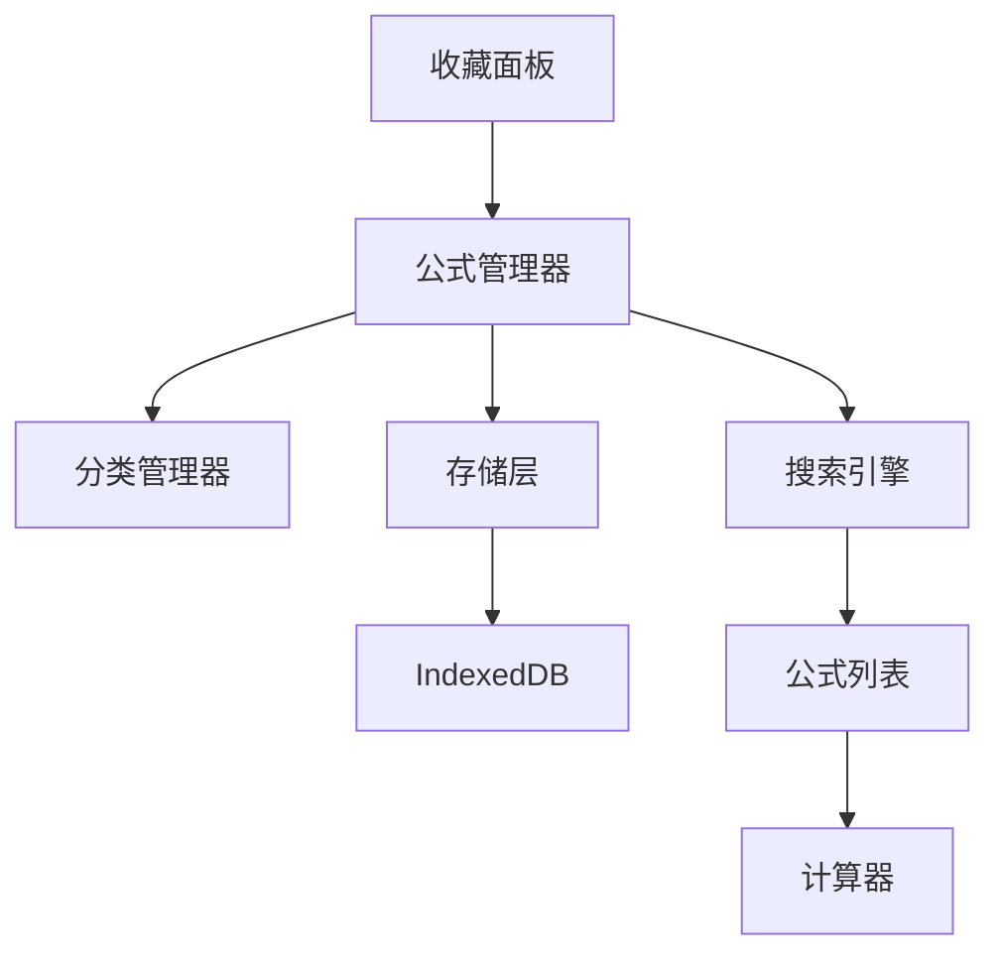

# 【计算器-公式收藏】概要设计

## 一、概述

本文档为计算器应用的公式收藏功能提供详细的技术设计方案。该功能将支持保存、分类、搜索和快速使用常用公式，提升用户的计算效率。

## 二、可行性分析

### 2.1 需求分析

| 产品需求 | 需求拆解 | 实施分块 |
| :------: | :------: | :------: |
| 公式管理 | 保存、编辑、删除公式 | 公式管理模块 |
| 分类系统 | 创建和管理公式分类 | 分类管理模块 |
| 搜索功能 | 按名称和内容搜索公式 | 搜索引擎模块 |
| 快速使用 | 一键填入和计算公式 | 使用操作模块 |

### 2.2 技术选型

- **IndexedDB**: 本地数据库存储
- **Fuse.js**: 模糊搜索引擎
- **React DnD**: 拖拽排序
- **UUID**: 唯一标识生成
- **JSON**: 数据导入导出

## 三、解决方案

### 3.1 系统架构



### 3.2 核心模块设计

#### 3.2.1 公式管理器

```typescript
interface FormulaManager {
  // 公式操作
  saveFormula(formula: Formula): Promise<string>;
  updateFormula(id: string, updates: Partial<Formula>): Promise<void>;
  deleteFormula(id: string): Promise<void>;
  getFormula(id: string): Promise<Formula | null>;
  
  // 批量操作
  getAllFormulas(): Promise<Formula[]>;
  getFormulasByCategory(category: string): Promise<Formula[]>;
  searchFormulas(query: string): Promise<Formula[]>;
  
  // 统计
  incrementUsageCount(id: string): Promise<void>;
  getMostUsed(limit: number): Promise<Formula[]>;
}

interface Formula {
  id: string;
  name: string;
  formula: string;
  expression: string;
  category: string;
  createdAt: number;
  updatedAt: number;
  usageCount: number;
  tags: string[];
}
```

#### 3.2.2 Redux状态管理

```typescript
interface FormulaState {
  formulas: Formula[];
  categories: Category[];
  selectedCategory: string;
  searchQuery: string;
  isLoading: boolean;
  isPanelVisible: boolean;
}

const formulaSlice = createSlice({
  name: 'formula',
  initialState: {
    formulas: [],
    categories: DEFAULT_CATEGORIES,
    selectedCategory: 'all',
    searchQuery: '',
    isLoading: false,
    isPanelVisible: false
  },
  reducers: {
    addFormula: (state, action: PayloadAction<Formula>) => {
      state.formulas.unshift(action.payload);
    },
    updateFormula: (state, action: PayloadAction<{id: string, updates: Partial<Formula>}>) => {
      const index = state.formulas.findIndex(f => f.id === action.payload.id);
      if (index !== -1) {
        state.formulas[index] = { ...state.formulas[index], ...action.payload.updates };
      }
    },
    deleteFormula: (state, action: PayloadAction<string>) => {
      state.formulas = state.formulas.filter(f => f.id !== action.payload);
    },
    setCategory: (state, action: PayloadAction<string>) => {
      state.selectedCategory = action.payload;
    },
    setSearchQuery: (state, action: PayloadAction<string>) => {
      state.searchQuery = action.payload;
    }
  }
});
```

## 四、实施计划

### 4.1 开发阶段

**阶段一：数据层 (2小时)**
- 实现IndexedDB存储
- 创建公式管理器
- 实现CRUD操作

**阶段二：UI组件 (2小时)**
- 创建收藏面板组件
- 实现公式列表显示
- 添加分类管理界面

**阶段三：搜索和使用 (1.5小时)**
- 集成Fuse.js搜索
- 实现公式快速使用
- 添加拖拽排序

**阶段四：优化测试 (0.5小时)**
- 性能优化
- 数据导入导出
- 边界情况处理

## 五、测试策略

### 5.1 功能测试
- 公式CRUD操作测试
- 分类管理测试
- 搜索功能测试

### 5.2 性能测试
- 大量公式加载测试
- 搜索性能测试
- 存储容量测试
