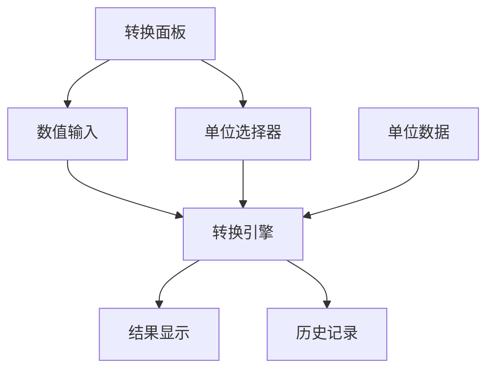

# 【计算器-单位转换】概要设计

## 一、概述

本文档为计算器应用的单位转换功能提供详细的技术设计方案。该功能将支持多种单位类别的双向转换，包括长度、重量、温度、面积、体积和时间等常用单位。

## 二、可行性分析

### 2.1 需求分析

| 产品需求 | 需求拆解 | 实施分块 |
| :------: | :------: | :------: |
| 单位转换 | 实现多种单位间的数值转换计算 | 转换引擎模块 |
| 单位管理 | 管理单位类别和具体单位数据 | 单位数据模块 |
| 转换界面 | 提供友好的转换操作界面 | 转换UI模块 |
| 历史记录 | 保存和管理转换历史 | 历史管理模块 |

### 2.2 技术选型

- **Decimal.js**: 高精度数值计算
- **React Select**: 单位选择组件
- **localStorage**: 历史记录存储
- **JSON配置**: 单位数据管理
- **CSS Grid**: 转换面板布局

## 三、解决方案

### 3.1 系统架构



### 3.2 核心模块设计

#### 3.2.1 转换引擎 (ConversionEngine)

```typescript
interface ConversionEngine {
  // 转换计算
  convert(value: number, fromUnit: string, toUnit: string, category: string): number;
  
  // 单位验证
  isValidUnit(unit: string, category: string): boolean;
  
  // 精度处理
  formatResult(value: number): string;
  
  // 特殊转换
  convertTemperature(value: number, from: string, to: string): number;
}

class UnitConverter implements ConversionEngine {
  private unitData: UnitData;
  
  convert(value: number, fromUnit: string, toUnit: string, category: string): number {
    if (category === 'temperature') {
      return this.convertTemperature(value, fromUnit, toUnit);
    }
    
    const fromFactor = this.unitData[category][fromUnit];
    const toFactor = this.unitData[category][toUnit];
    
    // 转换为基准单位，再转换为目标单位
    const baseValue = value * fromFactor;
    return baseValue / toFactor;
  }
}
```

#### 3.2.2 Redux状态管理

```typescript
interface ConversionState {
  selectedCategory: string;
  fromUnit: string;
  toUnit: string;
  inputValue: string;
  result: string;
  history: ConversionRecord[];
  isVisible: boolean;
}

const conversionSlice = createSlice({
  name: 'conversion',
  initialState: {
    selectedCategory: 'length',
    fromUnit: 'meter',
    toUnit: 'centimeter',
    inputValue: '',
    result: '',
    history: [],
    isVisible: false
  },
  reducers: {
    setCategory: (state, action) => {
      state.selectedCategory = action.payload;
      // 重置为该类别的默认单位
      const defaultUnits = getDefaultUnits(action.payload);
      state.fromUnit = defaultUnits.from;
      state.toUnit = defaultUnits.to;
    },
    setFromUnit: (state, action) => {
      state.fromUnit = action.payload;
    },
    setToUnit: (state, action) => {
      state.toUnit = action.payload;
    },
    setInputValue: (state, action) => {
      state.inputValue = action.payload;
      // 实时计算结果
      if (action.payload && !isNaN(Number(action.payload))) {
        state.result = calculateConversion(state);
      } else {
        state.result = '';
      }
    },
    swapUnits: (state) => {
      const temp = state.fromUnit;
      state.fromUnit = state.toUnit;
      state.toUnit = temp;
      // 重新计算结果
      if (state.inputValue) {
        state.result = calculateConversion(state);
      }
    },
    addToHistory: (state, action) => {
      state.history.unshift(action.payload);
      if (state.history.length > 10) {
        state.history = state.history.slice(0, 10);
      }
    }
  }
});
```

### 3.3 界面设计

#### 3.3.1 转换面板布局

```
┌─────────────────────────────────────┐
│ 单位转换                    [×]      │
├─────────────────────────────────────┤
│ 类别: [长度 ▼]                       │
├─────────────────────────────────────┤
│ [1000] [米 ▼]                       │
│        ⇅                           │
│ [100]  [厘米 ▼]                     │
├─────────────────────────────────────┤
│ 历史记录                             │
│ 1000米 = 100厘米                    │
│ 5英尺 = 1.524米                     │
└─────────────────────────────────────┘
```

#### 3.3.2 CSS样式定义

```css
.conversion-panel {
  width: 350px;
  background: var(--bg-secondary);
  border-left: 1px solid var(--border-color);
  padding: 16px;
  transform: translateX(100%);
  transition: transform 0.3s ease;
}

.conversion-panel.visible {
  transform: translateX(0);
}

.conversion-row {
  display: flex;
  align-items: center;
  gap: 12px;
  margin-bottom: 16px;
}

.conversion-input {
  flex: 1;
  padding: 8px 12px;
  border: 1px solid var(--border-color);
  border-radius: 4px;
  font-size: 16px;
}

.unit-select {
  min-width: 120px;
}

.swap-button {
  background: var(--primary-color);
  color: white;
  border: none;
  border-radius: 50%;
  width: 32px;
  height: 32px;
  cursor: pointer;
  display: flex;
  align-items: center;
  justify-content: center;
}

.conversion-history {
  max-height: 200px;
  overflow-y: auto;
}

.history-item {
  padding: 8px;
  border-bottom: 1px solid var(--border-color);
  cursor: pointer;
  font-size: 14px;
}

.history-item:hover {
  background: var(--button-hover);
}
```

### 3.4 数据流设计

#### 3.4.1 转换计算流程

```
用户输入数值
    ↓
dispatch(setInputValue(value))
    ↓
触发实时计算
    ↓
调用转换引擎
    ↓
更新结果显示
    ↓
添加到历史记录
```

### 3.5 算法实现

#### 3.5.1 单位数据配置

```typescript
const UNIT_DATA = {
  length: {
    meter: 1,
    centimeter: 0.01,
    millimeter: 0.001,
    kilometer: 1000,
    inch: 0.0254,
    foot: 0.3048,
    yard: 0.9144,
    mile: 1609.344
  },
  weight: {
    gram: 1,
    kilogram: 1000,
    ton: 1000000,
    pound: 453.592,
    ounce: 28.3495
  },
  temperature: {
    celsius: (c: number) => c,
    fahrenheit: (f: number) => (f - 32) * 5/9,
    kelvin: (k: number) => k - 273.15
  }
};
```

#### 3.5.2 温度转换算法

```typescript
class TemperatureConverter {
  static convert(value: number, from: string, to: string): number {
    // 先转换为摄氏度
    let celsius: number;
    switch (from) {
      case 'celsius':
        celsius = value;
        break;
      case 'fahrenheit':
        celsius = (value - 32) * 5/9;
        break;
      case 'kelvin':
        celsius = value - 273.15;
        break;
      default:
        throw new Error('Invalid temperature unit');
    }
    
    // 再从摄氏度转换为目标单位
    switch (to) {
      case 'celsius':
        return celsius;
      case 'fahrenheit':
        return celsius * 9/5 + 32;
      case 'kelvin':
        return celsius + 273.15;
      default:
        throw new Error('Invalid temperature unit');
    }
  }
}
```

## 四、实施计划

### 4.1 开发阶段

**阶段一：数据和引擎 (1.5小时)**
- 创建单位数据配置
- 实现转换引擎
- 实现温度特殊转换

**阶段二：UI组件 (2小时)**
- 创建转换面板组件
- 实现单位选择器
- 实现数值输入和结果显示

**阶段三：交互功能 (1小时)**
- 实现实时转换
- 实现单位交换
- 实现历史记录

**阶段四：优化测试 (0.5小时)**
- 精度优化
- 性能测试
- 边界情况处理

## 五、测试策略

### 5.1 单元测试
- 转换引擎准确性测试
- 温度转换特殊测试
- 精度处理测试

### 5.2 集成测试
- 实时转换功能测试
- 历史记录测试
- 单位交换测试

### 5.3 用户体验测试
- 转换速度测试
- 界面响应测试
- 移动端适配测试
