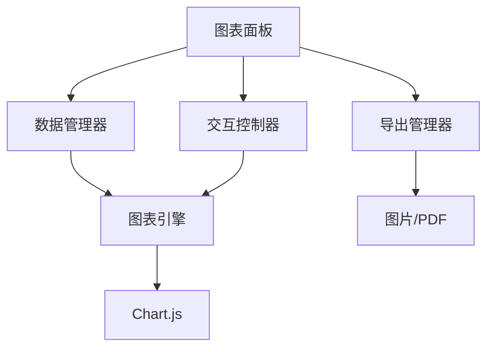

# 【计算器-图表可视化】概要设计

## 一、概述

本文档为计算器应用的图表可视化功能提供详细的技术设计方案。该功能将支持多种图表类型的数据展示，提供丰富的交互操作和导出功能。

## 二、可行性分析

### 2.1 需求分析

| 产品需求 | 需求拆解 | 实施分块 |
| :------: | :------: | :------: |
| 图表渲染 | 支持多种图表类型的绘制 | 图表引擎模块 |
| 数据管理 | 管理图表数据的输入和编辑 | 数据管理模块 |
| 交互控制 | 实现缩放、平移等交互 | 交互控制模块 |
| 导出功能 | 支持多种格式的图表导出 | 导出模块 |

### 2.2 技术选型

- **Chart.js**: 轻量级图表库
- **React-Chartjs-2**: React封装
- **html2canvas**: 图表截图
- **jsPDF**: PDF导出
- **Papa Parse**: CSV数据解析

## 三、解决方案

### 3.1 系统架构



### 3.2 核心模块设计

#### 3.2.1 图表管理器

```typescript
interface ChartManager {
  // 图表操作
  createChart(type: ChartType, data: ChartData): Chart;
  updateChart(id: string, data: ChartData): void;
  deleteChart(id: string): void;
  
  // 数据操作
  addDataPoint(chartId: string, point: DataPoint): void;
  updateDataPoint(chartId: string, index: number, point: DataPoint): void;
  removeDataPoint(chartId: string, index: number): void;
  
  // 导出
  exportAsImage(chartId: string, format: 'png' | 'svg'): Promise<Blob>;
  exportAsPDF(chartId: string): Promise<Blob>;
}

interface ChartData {
  labels: string[];
  datasets: Dataset[];
}

interface Dataset {
  label: string;
  data: number[];
  backgroundColor?: string;
  borderColor?: string;
}
```

#### 3.2.2 Redux状态管理

```typescript
interface ChartState {
  charts: Chart[];
  selectedChartId: string | null;
  chartType: ChartType;
  data: ChartData;
  options: ChartOptions;
  isVisible: boolean;
}

const chartSlice = createSlice({
  name: 'chart',
  initialState: {
    charts: [],
    selectedChartId: null,
    chartType: 'line',
    data: { labels: [], datasets: [] },
    options: DEFAULT_OPTIONS,
    isVisible: false
  },
  reducers: {
    createChart: (state, action) => {
      const newChart = {
        id: generateId(),
        ...action.payload
      };
      state.charts.push(newChart);
      state.selectedChartId = newChart.id;
    },
    updateChartData: (state, action) => {
      const chart = state.charts.find(c => c.id === state.selectedChartId);
      if (chart) {
        chart.data = action.payload;
      }
    },
    setChartType: (state, action) => {
      state.chartType = action.payload;
    }
  }
});
```

## 四、实施计划

### 4.1 开发阶段

**阶段一：图表基础 (2小时)**
- 集成Chart.js库
- 实现基础图表类型
- 创建图表组件

**阶段二：数据管理 (1.5小时)**
- 实现数据输入界面
- 添加数据编辑功能
- 支持CSV导入

**阶段三：交互和导出 (1.5小时)**
- 实现图表交互
- 添加导出功能
- 优化用户体验

**阶段四：优化测试 (1小时)**
- 性能优化
- 样式美化
- 兼容性测试

## 五、测试策略

### 5.1 功能测试
- 图表渲染测试
- 数据操作测试
- 导出功能测试

### 5.2 性能测试
- 大数据量渲染测试
- 交互响应测试
- 内存占用测试
