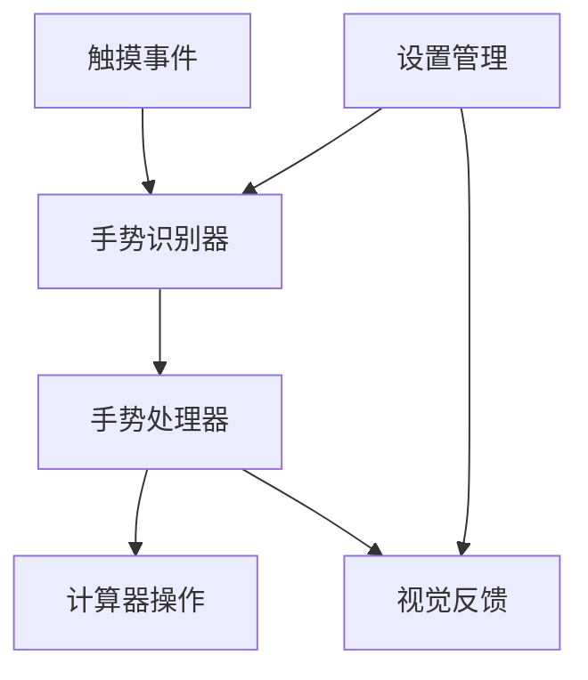

# 【计算器-手势操作】概要设计

## 一、概述

本文档为计算器应用的手势操作功能提供详细的技术设计方案。该功能将支持滑动、捏合、长按、双击等手势，提升移动端交互体验。

## 二、可行性分析

### 2.1 需求分析

| 产品需求 | 需求拆解 | 实施分块 |
| :------: | :------: | :------: |
| 手势识别 | 检测和识别各种触摸手势 | 手势识别模块 |
| 手势处理 | 将手势转换为具体操作 | 手势处理模块 |
| 视觉反馈 | 提供手势操作的视觉反馈 | 反馈系统模块 |
| 设置管理 | 管理手势开关和灵敏度 | 设置管理模块 |

### 2.2 技术选型

- **Hammer.js**: 手势识别库
- **Touch Events**: 原生触摸事件
- **CSS Transforms**: 缩放和动画
- **Vibration API**: 触觉反馈
- **localStorage**: 手势设置存储

## 三、解决方案

### 3.1 系统架构



### 3.2 核心模块设计

#### 3.2.1 手势识别器

```typescript
interface GestureRecognizer {
  // 手势注册
  registerSwipe(callback: (direction: string) => void): void;
  registerPinch(callback: (scale: number) => void): void;
  registerLongPress(callback: (element: HTMLElement) => void): void;
  registerDoubleTap(callback: (element: HTMLElement) => void): void;
  
  // 手势控制
  enable(): void;
  disable(): void;
  destroy(): void;
}

class HammerGestureRecognizer implements GestureRecognizer {
  private hammer: HammerManager;
  
  constructor(element: HTMLElement) {
    this.hammer = new Hammer(element);
    this.setupGestures();
  }
  
  private setupGestures(): void {
    // 配置滑动手势
    this.hammer.get('swipe').set({
      direction: Hammer.DIRECTION_ALL,
      threshold: 50,
      velocity: 0.3
    });
    
    // 配置捏合手势
    this.hammer.get('pinch').set({ enable: true });
    
    // 配置长按手势
    this.hammer.get('press').set({ time: 800 });
  }
}
```

#### 3.2.2 手势处理器

```typescript
class GestureHandler {
  private calculator: CalculatorRef;
  
  constructor(calculator: CalculatorRef) {
    this.calculator = calculator;
  }
  
  handleSwipe(direction: string): void {
    switch (direction) {
      case 'left':
        this.calculator.deleteLast();
        break;
      case 'right':
        this.calculator.undo();
        break;
      case 'up':
        this.calculator.openHistory();
        break;
      case 'down':
        this.calculator.closePanel();
        break;
    }
  }
  
  handlePinch(scale: number): void {
    const currentScale = this.calculator.getScale();
    const newScale = Math.max(0.8, Math.min(2.0, currentScale * scale));
    this.calculator.setScale(newScale);
  }
  
  handleLongPress(element: HTMLElement): void {
    if (element.classList.contains('number-button')) {
      this.showQuickInput(element);
    } else if (element.classList.contains('result-display')) {
      this.showResultMenu();
    }
  }
  
  handleDoubleTap(element: HTMLElement): void {
    if (element.classList.contains('result-display')) {
      this.calculator.copyResult();
      this.showCopyFeedback();
    }
  }
}
```

## 四、实施计划

### 4.1 开发阶段

**阶段一：手势识别 (2小时)**
- 集成Hammer.js库
- 实现基础手势识别
- 配置手势参数

**阶段二：手势处理 (1.5小时)**
- 实现手势到操作的映射
- 添加手势处理逻辑
- 集成到计算器功能

**阶段三：反馈系统 (1小时)**
- 实现视觉反馈动画
- 添加触觉反馈
- 优化用户体验

**阶段四：设置和优化 (0.5小时)**
- 添加手势设置选项
- 性能优化
- 兼容性测试

## 五、测试策略

### 5.1 功能测试
- 各种手势识别测试
- 手势操作正确性测试
- 反馈系统测试

### 5.2 兼容性测试
- 不同设备测试
- 不同浏览器测试
- 多点触控测试
