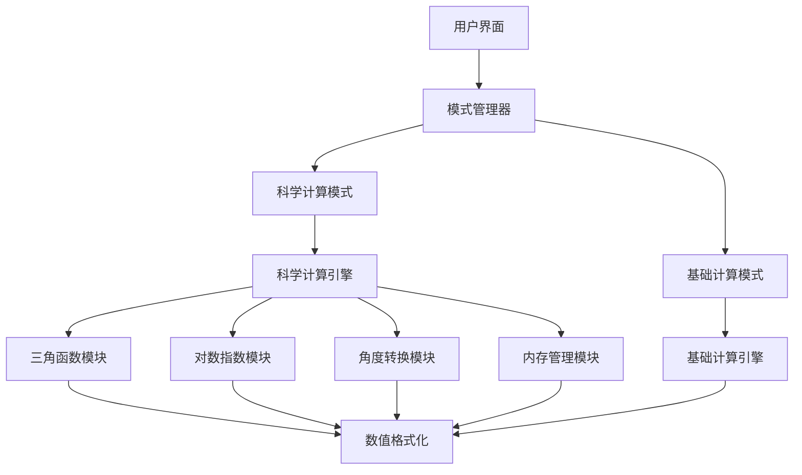

# 【计算器-科学计算】概要设计

## 一、概述

本文档为现有计算器应用的科学计算功能扩展提供详细的技术设计方案。该扩展将在保持原有基础计算功能的基础上，增加三角函数、对数、指数等高级数学运算能力，满足专业用户的科学计算需求。

## 二、可行性分析

### 2.1 需求分析扩展

在原有基础计算需求基础上，新增科学计算需求：

| 产品需求 | 需求拆解 | 实施分块 |
| :------: | :------: | :------: |
| 科学函数 | 实现三角、对数、指数等数学函数，支持高精度计算 | 科学计算引擎模块 |
| 角度模式 | 支持度/弧度/梯度三种角度单位，自动转换 | 角度管理模块 |
| 科学记数法 | 大数和小数的科学记数法显示，E记数法输入 | 数值格式化模块 |
| 扩展界面 | 科学模式界面，函数按钮布局，模式切换 | 科学UI组件模块 |
| 内存功能 | M+, M-, MR, MC 内存操作，多内存槽支持 | 内存管理模块 |

### 2.2 技术选型扩展

在原有技术栈基础上增加：

- **数学计算库**: Math.js (高精度科学计算)
- **函数解析器**: Expression-eval (表达式解析)
- **常数库**: 内置高精度数学常数 (π, e, φ等)
- **角度转换**: 自研角度单位转换工具
- **科学记数法**: 自研格式化工具

## 三、解决方案

### 3.1 系统架构扩展

在原有架构基础上增加科学计算层：



### 3.2 核心模块设计

#### 3.2.1 科学计算引擎 (ScientificCalculator)

```typescript
interface ScientificCalculator {
  // 三角函数
  sin(value: number, angleMode: AngleMode): number;
  cos(value: number, angleMode: AngleMode): number;
  tan(value: number, angleMode: AngleMode): number;
  asin(value: number, angleMode: AngleMode): number;
  acos(value: number, angleMode: AngleMode): number;
  atan(value: number, angleMode: AngleMode): number;
  
  // 对数函数
  ln(value: number): number;
  log(value: number): number;
  log2(value: number): number;
  logBase(value: number, base: number): number;
  
  // 指数函数
  exp(value: number): number;
  pow10(value: number): number;
  power(base: number, exponent: number): number;
  square(value: number): number;
  
  // 根式函数
  sqrt(value: number): number;
  cbrt(value: number): number;
  nthRoot(value: number, n: number): number;
  
  // 其他函数
  factorial(n: number): number;
  percentage(value: number): number;
}
```

#### 3.2.2 角度管理模块 (AngleManager)

```typescript
enum AngleMode {
  DEGREE = 'DEG',
  RADIAN = 'RAD',
  GRADIAN = 'GRAD'
}

interface AngleManager {
  currentMode: AngleMode;
  setMode(mode: AngleMode): void;
  toRadians(value: number): number;
  fromRadians(value: number): number;
  convert(value: number, from: AngleMode, to: AngleMode): number;
}
```

#### 3.2.3 内存管理模块 (MemoryManager)

```typescript
interface MemoryManager {
  memory: number[];
  store(value: number, slot?: number): void;
  recall(slot?: number): number;
  add(value: number, slot?: number): void;
  subtract(value: number, slot?: number): void;
  clear(slot?: number): void;
  clearAll(): void;
}
```

#### 3.2.4 数值格式化模块 (NumberFormatter)

```typescript
interface NumberFormatter {
  formatScientific(value: number, precision?: number): string;
  formatStandard(value: number, precision?: number): string;
  parseScientific(input: string): number;
  shouldUseScientific(value: number): boolean;
  formatWithPrecision(value: number, precision: number): string;
}
```

### 3.3 界面设计

#### 3.3.1 科学模式布局

**PC端科学模式：**
```
┌─────────────────────────────────────┐
│ 显示屏区域                           │
│ ┌─────────────────────────────────┐ │
│ │ 12.34567890123456789           │ │
│ │ sin(30°) = 0.5                 │ │
│ └─────────────────────────────────┘ │
├─────────────────────────────────────┤
│ 模式切换: [标准] [科学] [程序员]      │
│ 角度模式: [DEG] RAD  GRAD           │
├─────────────────────────────────────┤
│ 科学函数区域                         │
│ [sin] [cos] [tan] [ln] [log]        │
│ [asin][acos][atan][e^x][10^x]       │
│ [π]   [e]   [x²]  [√x] [x^y]        │
├─────────────────────────────────────┤
│ 数字和基础运算区域                   │
│ [MC] [MR] [M+] [M-] [C] [AC]        │
│ [7]  [8]  [9]  [÷]  [(]  [)]        │
│ [4]  [5]  [6]  [×]  [x!] [%]        │
│ [1]  [2]  [3]  [-]  [EE] [±]        │
│ [0]       [.]  [+]       [=]        │
└─────────────────────────────────────┘
```

#### 3.3.2 响应式设计

**移动端适配：**
- 竖屏：显示基础计算器，底部抽屉展示科学函数
- 横屏：自动切换到科学模式，显示完整科学计算器
- 长按按钮：显示第二功能（如sin⁻¹）

### 3.4 数据流设计

#### 3.4.1 状态管理扩展

```typescript
interface ScientificCalculatorState {
  // 继承基础计算器状态
  ...BasicCalculatorState;
  
  // 科学计算扩展状态
  angleMode: AngleMode;
  isScientificMode: boolean;
  memory: number[];
  lastFunction: string;
  functionHistory: string[];
  precision: number;
  useScientificNotation: boolean;
}
```

#### 3.4.2 Action 扩展

```typescript
type ScientificCalculatorAction = 
  | BasicCalculatorAction
  | { type: 'SET_ANGLE_MODE'; payload: AngleMode }
  | { type: 'TOGGLE_SCIENTIFIC_MODE' }
  | { type: 'EXECUTE_FUNCTION'; payload: { func: string; value: number } }
  | { type: 'MEMORY_STORE'; payload: { value: number; slot?: number } }
  | { type: 'MEMORY_RECALL'; payload: { slot?: number } }
  | { type: 'MEMORY_ADD'; payload: { value: number; slot?: number } }
  | { type: 'MEMORY_CLEAR'; payload: { slot?: number } }
  | { type: 'SET_PRECISION'; payload: number };
```

### 3.5 算法实现

#### 3.5.1 高精度计算

```typescript
class HighPrecisionMath {
  private static readonly PRECISION = 15;
  
  static sin(x: number, angleMode: AngleMode): number {
    const radians = AngleManager.toRadians(x, angleMode);
    return this.roundToPrecision(Math.sin(radians));
  }
  
  static ln(x: number): number {
    if (x <= 0) throw new Error('对数的真数必须大于0');
    return this.roundToPrecision(Math.log(x));
  }
  
  private static roundToPrecision(value: number): number {
    return Number(value.toPrecision(this.PRECISION));
  }
}
```

#### 3.5.2 表达式解析

```typescript
class ExpressionParser {
  private static readonly FUNCTIONS = [
    'sin', 'cos', 'tan', 'asin', 'acos', 'atan',
    'ln', 'log', 'exp', 'sqrt', 'factorial'
  ];
  
  static parse(expression: string): number {
    // 替换数学常数
    expression = expression.replace(/π/g, Math.PI.toString());
    expression = expression.replace(/e/g, Math.E.toString());
    
    // 解析和计算表达式
    return this.evaluate(expression);
  }
}
```

## 四、实施计划

### 4.1 开发阶段

**阶段一：核心计算引擎 (2周)**
- 实现科学计算引擎
- 开发角度管理模块
- 实现高精度数学函数

**阶段二：界面扩展 (2周)**
- 设计科学模式界面
- 实现模式切换功能
- 开发响应式布局

**阶段三：功能集成 (1周)**
- 集成内存管理功能
- 实现科学记数法显示
- 完善错误处理

**阶段四：测试优化 (1周)**
- 单元测试和集成测试
- 性能优化
- 用户体验优化

### 4.2 技术风险与对策

**风险1：浮点数精度问题**
- 对策：使用高精度数学库，实现自定义精度控制

**风险2：复杂界面性能**
- 对策：虚拟化长列表，按需加载功能模块

**风险3：跨平台兼容性**
- 对策：统一数学库，充分的跨平台测试

## 五、测试策略

### 5.1 单元测试
- 科学函数计算精度测试
- 角度转换准确性测试
- 边界条件处理测试

### 5.2 集成测试
- 基础计算与科学计算模式切换
- 历史记录功能兼容性
- 内存功能完整性

### 5.3 用户体验测试
- 界面响应性能测试
- 跨设备兼容性测试
- 用户操作流程测试
