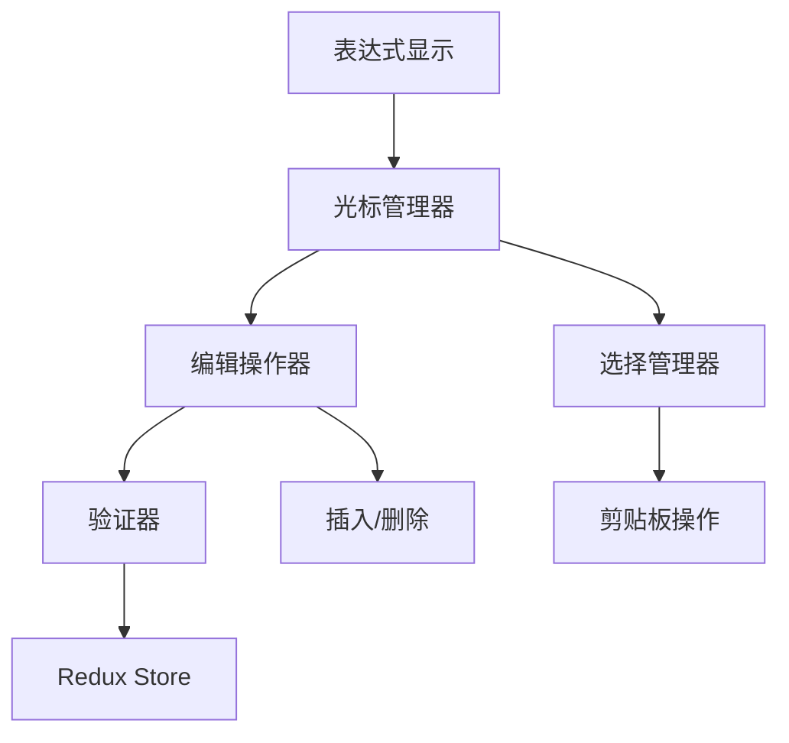

# 【计算器-表达式编辑】概要设计

## 一、概述

本文档为计算器应用的表达式编辑功能提供详细的技术设计方案。该功能将支持光标定位、插入编辑、删除操作和文本选择，让用户能够灵活修改表达式内容，提升输入效率和用户体验。

## 二、可行性分析

### 2.1 需求分析

| 产品需求 | 需求拆解 | 实施分块 |
| :------: | :------: | :------: |
| 光标定位 | 点击定位光标，支持键盘移动 | 光标管理模块 |
| 插入编辑 | 在光标位置插入字符，验证合法性 | 编辑操作模块 |
| 删除操作 | 支持前删除和后删除 | 删除管理模块 |
| 文本选择 | 支持鼠标和键盘选择文本 | 选择管理模块 |

### 2.2 技术选型

- **Canvas API**: 精确计算文本宽度和光标位置
- **Selection API**: 处理文本选择操作
- **React Refs**: 获取DOM元素引用
- **requestAnimationFrame**: 实现光标闪烁动画
- **正则表达式**: 验证表达式合法性

## 三、解决方案

### 3.1 系统架构



### 3.2 核心模块设计

#### 3.2.1 光标管理器 (CursorManager)

```typescript
interface CursorManager {
  position: number;
  isVisible: boolean;
  
  // 光标操作
  setCursorPosition(position: number): void;
  moveCursor(direction: 'left' | 'right'): void;
  getCursorPixelPosition(): number;
  
  // 光标显示
  showCursor(): void;
  hideCursor(): void;
  startBlinking(): void;
  stopBlinking(): void;
  
  // 位置计算
  getPositionFromClick(x: number): number;
  getPixelPosition(textPosition: number): number;
}
```

#### 3.2.2 编辑状态管理

```typescript
interface EditState {
  expression: string;
  cursorPosition: number;
  selectionStart: number;
  selectionEnd: number;
  isEditing: boolean;
}

const editSlice = createSlice({
  name: 'edit',
  initialState: {
    expression: '',
    cursorPosition: 0,
    selectionStart: -1,
    selectionEnd: -1,
    isEditing: false
  },
  reducers: {
    setCursorPosition: (state, action: PayloadAction<number>) => {
      state.cursorPosition = Math.max(0, Math.min(action.payload, state.expression.length));
      state.selectionStart = -1;
      state.selectionEnd = -1;
    },
    insertAtCursor: (state, action: PayloadAction<string>) => {
      const { cursorPosition, expression } = state;
      const newExpression = expression.slice(0, cursorPosition) + 
                           action.payload + 
                           expression.slice(cursorPosition);
      state.expression = newExpression;
      state.cursorPosition = cursorPosition + action.payload.length;
    },
    deleteAtCursor: (state, action: PayloadAction<'before' | 'after'>) => {
      const { cursorPosition, expression } = state;
      if (action.payload === 'before' && cursorPosition > 0) {
        state.expression = expression.slice(0, cursorPosition - 1) + 
                          expression.slice(cursorPosition);
        state.cursorPosition = cursorPosition - 1;
      } else if (action.payload === 'after' && cursorPosition < expression.length) {
        state.expression = expression.slice(0, cursorPosition) + 
                          expression.slice(cursorPosition + 1);
      }
    },
    setSelection: (state, action: PayloadAction<{start: number, end: number}>) => {
      state.selectionStart = action.payload.start;
      state.selectionEnd = action.payload.end;
    },
    replaceSelection: (state, action: PayloadAction<string>) => {
      const { selectionStart, selectionEnd, expression } = state;
      if (selectionStart >= 0 && selectionEnd >= 0) {
        const start = Math.min(selectionStart, selectionEnd);
        const end = Math.max(selectionStart, selectionEnd);
        state.expression = expression.slice(0, start) + 
                          action.payload + 
                          expression.slice(end);
        state.cursorPosition = start + action.payload.length;
        state.selectionStart = -1;
        state.selectionEnd = -1;
      }
    }
  }
});
```

#### 3.2.3 可编辑表达式组件

```typescript
export const EditableExpression: React.FC = () => {
  const dispatch = useDispatch();
  const { expression, cursorPosition, selectionStart, selectionEnd, isEditing } = 
    useSelector((state: RootState) => state.edit);
  
  const containerRef = useRef<HTMLDivElement>(null);
  const canvasRef = useRef<HTMLCanvasElement>(null);
  const cursorRef = useRef<HTMLDivElement>(null);
  
  // 计算光标像素位置
  const getCursorPixelPosition = useCallback((position: number): number => {
    const canvas = canvasRef.current;
    if (!canvas) return 0;
    
    const ctx = canvas.getContext('2d');
    if (!ctx) return 0;
    
    ctx.font = '24px monospace';
    const textBeforeCursor = expression.slice(0, position);
    return ctx.measureText(textBeforeCursor).width;
  }, [expression]);
  
  // 处理点击定位
  const handleClick = useCallback((event: React.MouseEvent) => {
    const container = containerRef.current;
    if (!container) return;
    
    const rect = container.getBoundingClientRect();
    const clickX = event.clientX - rect.left;
    
    // 二分查找最接近的字符位置
    let left = 0;
    let right = expression.length;
    
    while (left < right) {
      const mid = Math.floor((left + right) / 2);
      const midX = getCursorPixelPosition(mid);
      
      if (midX < clickX) {
        left = mid + 1;
      } else {
        right = mid;
      }
    }
    
    dispatch(setCursorPosition(left));
  }, [expression, getCursorPixelPosition, dispatch]);
  
  // 处理键盘事件
  const handleKeyDown = useCallback((event: KeyboardEvent) => {
    if (!isEditing) return;
    
    switch (event.key) {
      case 'ArrowLeft':
        event.preventDefault();
        if (event.shiftKey) {
          // 扩展选择
          handleSelectionExtend('left');
        } else {
          dispatch(setCursorPosition(cursorPosition - 1));
        }
        break;
        
      case 'ArrowRight':
        event.preventDefault();
        if (event.shiftKey) {
          // 扩展选择
          handleSelectionExtend('right');
        } else {
          dispatch(setCursorPosition(cursorPosition + 1));
        }
        break;
        
      case 'Home':
        event.preventDefault();
        dispatch(setCursorPosition(0));
        break;
        
      case 'End':
        event.preventDefault();
        dispatch(setCursorPosition(expression.length));
        break;
        
      case 'Backspace':
        event.preventDefault();
        if (selectionStart >= 0) {
          dispatch(replaceSelection(''));
        } else {
          dispatch(deleteAtCursor('before'));
        }
        break;
        
      case 'Delete':
        event.preventDefault();
        if (selectionStart >= 0) {
          dispatch(replaceSelection(''));
        } else {
          dispatch(deleteAtCursor('after'));
        }
        break;
    }
  }, [isEditing, cursorPosition, selectionStart, dispatch]);
  
  return (
    <div 
      ref={containerRef}
      className="editable-expression"
      onClick={handleClick}
      tabIndex={0}
    >
      <canvas ref={canvasRef} style={{ display: 'none' }} />
      
      {/* 表达式文本 */}
      <div className="expression-text">
        {renderExpressionWithSelection()}
      </div>
      
      {/* 光标 */}
      {isEditing && (
        <div
          ref={cursorRef}
          className="cursor"
          style={{
            left: getCursorPixelPosition(cursorPosition),
            display: selectionStart >= 0 ? 'none' : 'block'
          }}
        />
      )}
    </div>
  );
};
```

### 3.3 界面设计

#### 3.3.1 光标和选择样式

```css
.editable-expression {
  position: relative;
  padding: 8px 12px;
  border: 2px solid transparent;
  border-radius: 4px;
  cursor: text;
  user-select: none;
}

.editable-expression:focus {
  outline: none;
  border-color: var(--primary-color);
}

.cursor {
  position: absolute;
  top: 8px;
  width: 2px;
  height: 24px;
  background-color: var(--primary-color);
  animation: blink 1s infinite;
}

@keyframes blink {
  0%, 50% { opacity: 1; }
  51%, 100% { opacity: 0; }
}

.expression-text {
  font-family: 'Courier New', monospace;
  font-size: 24px;
  line-height: 24px;
  white-space: nowrap;
}

.selected-text {
  background-color: var(--selection-bg);
  color: var(--selection-text);
  border-radius: 2px;
}
```

### 3.4 数据流设计

#### 3.4.1 编辑操作流程

```
用户点击表达式
    ↓
计算点击位置对应的字符索引
    ↓
dispatch(setCursorPosition(index))
    ↓
更新Redux状态
    ↓
重新渲染光标位置
```

#### 3.4.2 插入操作流程

```
用户输入字符
    ↓
验证字符合法性
    ↓
dispatch(insertAtCursor(char))
    ↓
在光标位置插入字符
    ↓
更新光标位置
    ↓
重新渲染表达式
```

### 3.5 算法实现

#### 3.5.1 位置计算算法

```typescript
class PositionCalculator {
  private canvas: HTMLCanvasElement;
  private ctx: CanvasRenderingContext2D;
  
  constructor() {
    this.canvas = document.createElement('canvas');
    this.ctx = this.canvas.getContext('2d')!;
    this.ctx.font = '24px Courier New';
  }
  
  getCharacterPosition(text: string, index: number): number {
    const textBeforeIndex = text.slice(0, index);
    return this.ctx.measureText(textBeforeIndex).width;
  }
  
  getIndexFromPosition(text: string, x: number): number {
    let left = 0;
    let right = text.length;
    
    while (left < right) {
      const mid = Math.floor((left + right) / 2);
      const midX = this.getCharacterPosition(text, mid);
      const nextX = this.getCharacterPosition(text, mid + 1);
      
      if (x >= midX && x < nextX) {
        // 判断更接近哪个位置
        return (x - midX) < (nextX - x) ? mid : mid + 1;
      } else if (midX < x) {
        left = mid + 1;
      } else {
        right = mid;
      }
    }
    
    return left;
  }
}
```

#### 3.5.2 表达式验证算法

```typescript
class ExpressionValidator {
  static canInsertAt(expression: string, position: number, char: string): boolean {
    const before = expression[position - 1];
    const after = expression[position];
    
    if (/\d/.test(char)) {
      // 数字可以插入到大部分位置
      return true;
    }
    
    if (/[+\-*/]/.test(char)) {
      // 运算符不能连续，不能在开头
      return position > 0 && !/[+\-*/]/.test(before);
    }
    
    if (char === '.') {
      // 小数点不能重复，必须在数字中
      const beforeDot = expression.slice(0, position);
      const afterDot = expression.slice(position);
      
      // 检查当前数字是否已有小数点
      const currentNumberMatch = beforeDot.match(/(\d*\.?\d*)$/);
      if (currentNumberMatch && currentNumberMatch[1].includes('.')) {
        return false;
      }
      
      return /\d/.test(before) || /\d/.test(after);
    }
    
    return false;
  }
  
  static validateExpression(expression: string): boolean {
    // 基本格式验证
    if (!/^[\d+\-*/.() ]*$/.test(expression)) return false;
    
    // 不能以运算符结尾
    if (/[+\-*/]$/.test(expression)) return false;
    
    // 运算符不能连续
    if (/[+\-*/]{2,}/.test(expression)) return false;
    
    // 小数点格式检查
    if (/\.{2,}/.test(expression)) return false;
    
    return true;
  }
}
```

## 四、实施计划

### 4.1 开发阶段

**阶段一：光标基础功能 (2小时)**
- 实现光标定位和显示
- 实现点击定位功能
- 实现键盘移动光标

**阶段二：编辑操作 (1.5小时)**
- 实现插入字符功能
- 实现删除操作
- 添加表达式验证

**阶段三：文本选择 (1.5小时)**
- 实现鼠标拖拽选择
- 实现键盘选择扩展
- 实现剪贴板操作

**阶段四：优化和测试 (1小时)**
- 性能优化
- 移动端适配
- 边界情况处理

### 4.2 技术风险与对策

**风险1：光标位置计算不准确**
- 对策：使用Canvas精确测量文本宽度

**风险2：移动端选择体验差**
- 对策：提供自定义选择手柄

**风险3：表达式验证复杂**
- 对策：分步验证，实时反馈

## 五、测试策略

### 5.1 单元测试
- 位置计算算法测试
- 表达式验证测试
- 编辑操作测试

### 5.2 集成测试
- 光标定位准确性测试
- 编辑功能完整性测试
- 选择操作测试

### 5.3 用户体验测试
- 响应速度测试
- 移动端触摸测试
- 键盘快捷键测试
