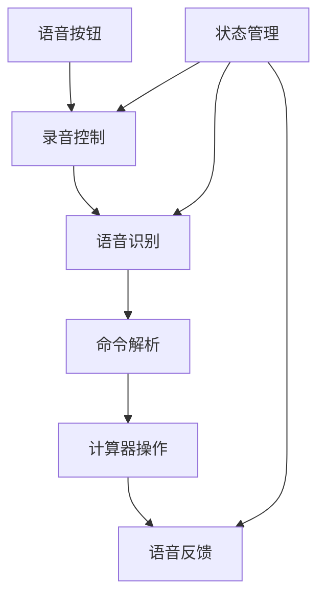

# 【计算器-语音输入】概要设计

## 一、概述

本文档为计算器应用的语音输入功能提供详细的技术设计方案。该功能将支持语音识别数字、运算符和数学表达式，提供免手操作体验。

## 二、可行性分析

### 2.1 需求分析

| 产品需求 | 需求拆解 | 实施分块 |
| :------: | :------: | :------: |
| 语音识别 | 录音、语音转文字、结果解析 | 语音识别模块 |
| 命令解析 | 将语音文字转换为计算器操作 | 命令解析模块 |
| 语音反馈 | 播报识别结果和计算结果 | 语音合成模块 |
| 状态管理 | 管理录音状态和识别流程 | 状态管理模块 |

### 2.2 技术选型

- **Web Speech API**: 浏览器原生语音识别
- **SpeechSynthesis API**: 语音合成播报
- **MediaRecorder API**: 录音控制
- **正则表达式**: 语音命令解析
- **状态机**: 语音识别流程控制

## 三、解决方案

### 3.1 系统架构



### 3.2 核心模块设计

#### 3.2.1 语音识别管理器

```typescript
interface SpeechManager {
  isSupported(): boolean;
  startRecording(): Promise<void>;
  stopRecording(): void;
  onResult(callback: (text: string) => void): void;
  onError(callback: (error: string) => void): void;
}

class WebSpeechManager implements SpeechManager {
  private recognition: SpeechRecognition;
  private isRecording = false;
  
  constructor() {
    this.recognition = new webkitSpeechRecognition();
    this.recognition.continuous = false;
    this.recognition.interimResults = false;
    this.recognition.lang = 'zh-CN';
  }
}
```

#### 3.2.2 命令解析器

```typescript
class VoiceCommandParser {
  private static readonly COMMAND_MAP = {
    '零': '0', '一': '1', '二': '2', '三': '3', '四': '4',
    '五': '5', '六': '6', '七': '7', '八': '8', '九': '9',
    '加': '+', '减': '-', '乘': '×', '除': '÷',
    '点': '.', '等于': '=', '清空': 'clear'
  };
  
  static parseCommand(text: string): string[] {
    const commands: string[] = [];
    const words = text.split(/\s+/);
    
    for (const word of words) {
      if (this.COMMAND_MAP[word]) {
        commands.push(this.COMMAND_MAP[word]);
      }
    }
    
    return commands;
  }
}
```

## 四、实施计划

### 4.1 开发阶段

**阶段一：语音识别基础 (2小时)**
- 实现Web Speech API集成
- 创建录音控制逻辑
- 实现基础语音识别

**阶段二：命令解析 (1.5小时)**
- 实现语音命令映射
- 创建命令解析器
- 集成到计算器操作

**阶段三：语音反馈 (1小时)**
- 实现语音合成播报
- 添加状态指示动画
- 优化用户体验

**阶段四：测试优化 (0.5小时)**
- 兼容性测试
- 准确率优化
- 错误处理完善

## 五、测试策略

### 5.1 功能测试
- 语音识别准确性测试
- 命令解析正确性测试
- 语音反馈测试

### 5.2 兼容性测试
- 不同浏览器测试
- 移动端适配测试
- 网络环境测试
