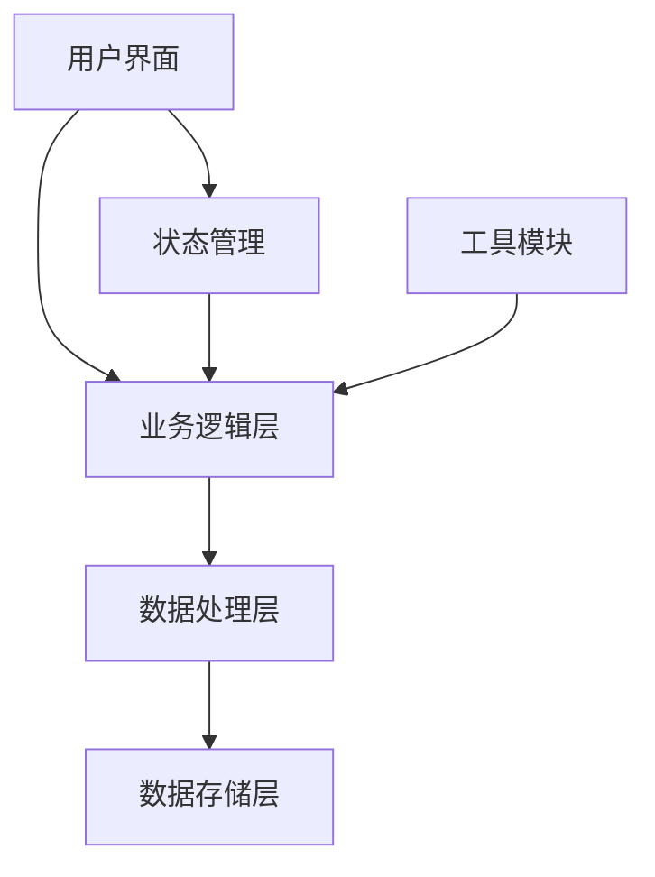

# 【计算机-语音输入】概要设计

## 一、概述

本文档为计算机-语音输入功能提供详细的技术设计方案。该功能将实现可以语音输入，采用现代化的技术架构和用户友好的界面设计。

## 二、可行性分析

### 2.1 需求分析

| 产品需求 | 需求拆解 | 实施分块 |
| :------: | :------: | :------: |
| 实现可以语音输入 | 分解为多个子功能模块实现 | 前端UI模块 |
| 用户界面 | 设计友好的用户交互界面 | UI组件模块 |
| 数据处理 | 实现核心业务逻辑 | 数据处理模块 |
| 系统集成 | 与现有系统集成 | 集成接口模块 |

### 2.2 技术选型

- **前端框架**: Vanilla JavaScript
- **类型系统**: TypeScript
- **样式方案**: CSS3/SCSS
- **构建工具**: Webpack/Vite

## 三、解决方案

### 3.1 系统架构



### 3.2 核心模块设计

#### 3.2.1 用户界面模块 (UI Module)

```typescript
interface UIModule {
  // 界面渲染
  render(): void;
  
  // 事件处理
  handleUserInput(event: Event): void;
  
  // 状态更新
  updateDisplay(data: any): void;
}
```

**主要功能：**
- 用户交互界面
- 事件监听和处理
- 数据展示和反馈

#### 3.2.2 业务逻辑模块 (Business Logic)

```typescript
interface BusinessLogic {
  // 核心处理
  processData(input: any): any;
  
  // 数据验证
  validateInput(data: any): boolean;
  
  // 结果计算
  calculateResult(params: any): any;
}
```

**主要功能：**
- 核心业务逻辑实现
- 数据验证和处理
- 结果计算和生成

## 四、详细设计

### 4.1 数据结构设计

```typescript
// 主要数据结构
interface MainData {
  id: string;
  name: string;
  value: any;
  timestamp: number;
  metadata?: any;
}

// 配置数据
interface Config {
  theme: string;
  language: string;
  preferences: any;
}
```

### 4.2 接口设计

#### 4.2.1 内部接口

```typescript
// 组件通信接口
interface ComponentAPI {
  init(): void;
  update(data: any): void;
  destroy(): void;
}
```

### 4.3 算法设计

**核心算法：**
采用高效的数据处理算法，确保操作响应速度和准确性。

**性能优化：**
- 数据缓存机制
- 懒加载策略
- 防抖和节流

## 五、实现方案

### 5.1 开发环境

- **开发工具：** VS Code, Chrome DevTools
- **版本控制：** Git
- **包管理：** npm/yarn
- **构建工具：** Vite

### 5.2 代码结构

```
src/
├── components/          # 组件目录
├── utils/              # 工具函数
├── styles/             # 样式文件
└── types/              # 类型定义
```

## 六、测试方案

### 6.1 单元测试
- 使用Jest框架
- 覆盖率要求 > 80%

### 6.2 集成测试
- 组件间交互测试
- 接口集成测试

---
*文档生成时间：2025/12/18 14:11:04*
